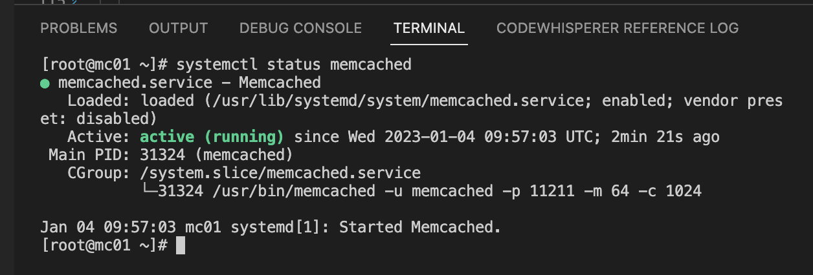
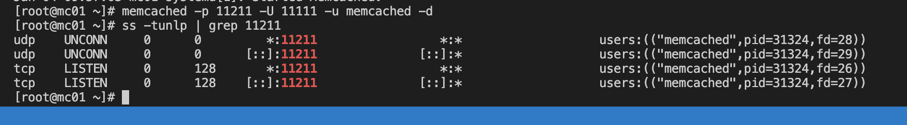
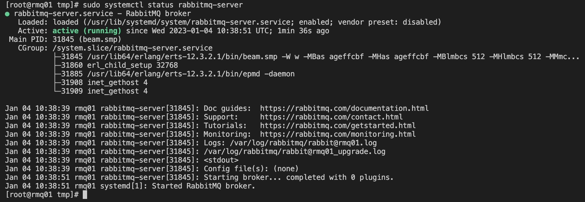
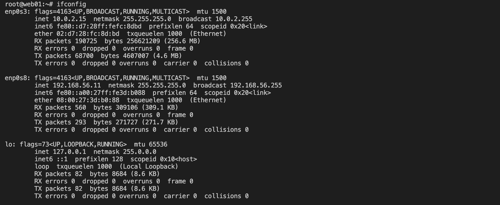
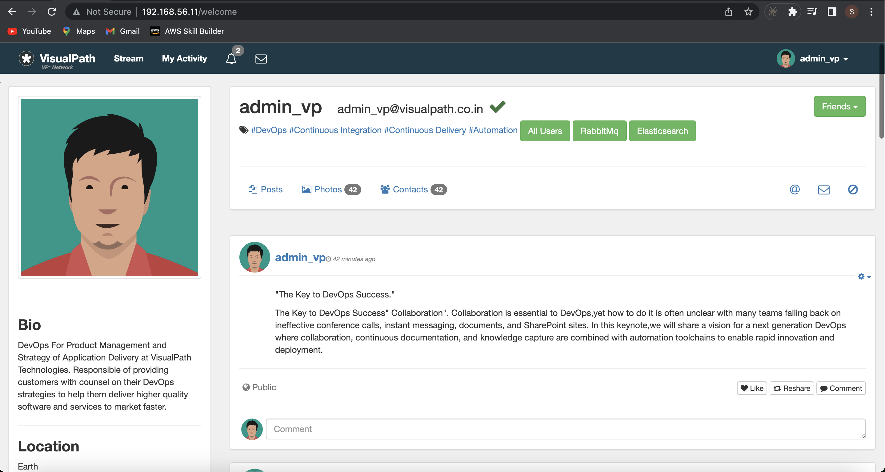
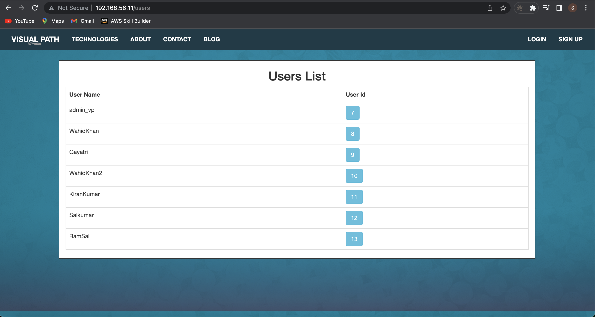
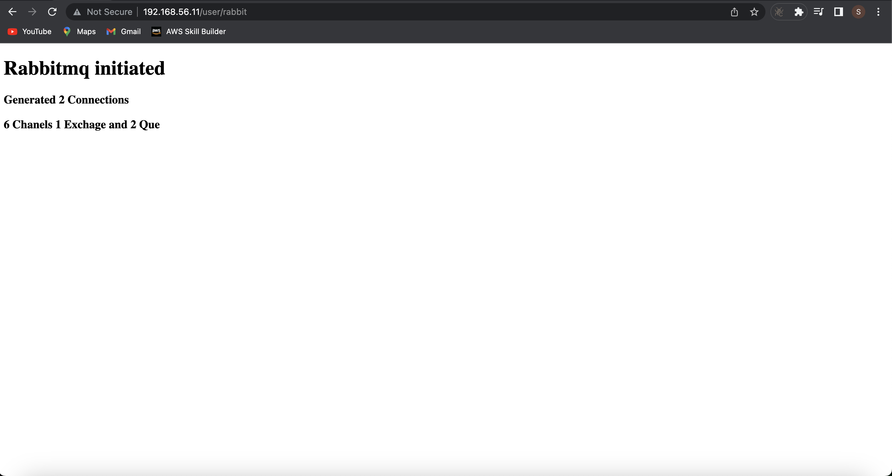
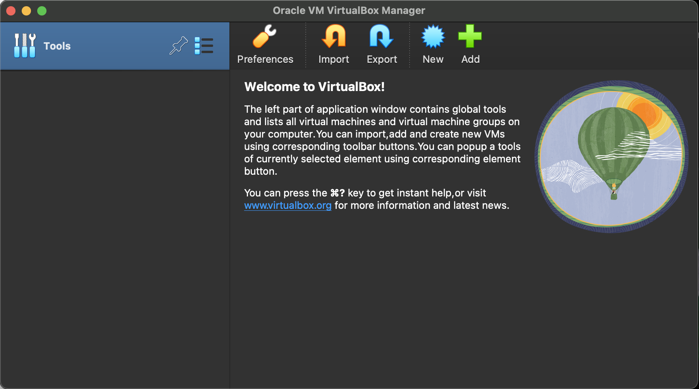

# Multi Tier Web Application Setup On A Local Machine Using A Manual Process
##  Prerequisite

1. Oracle VM Virtualbox
2. Vagrant
3. Vagrant plugins
    + vagrant plugin install vagrant-hostmanager
    + vagrant plugin install vagrant-vbguest
4. Git bash or equivalent editor

##  System Architecture

  + The architecture basically deploy multi tier application which include:- NGINX, Apache Tomcat, RabbitMQ, Memcached and MySql servers on a virtual box manually. Explanation of each includes -
    + **Load balancer** - Provides an IP address to access the web application
    + **NGINX** - A server for load balancing experience that routes request to a web server e.g:- Apache Tomcat Server
    + **Apache Tomcat** - A web server that hosts Java based application alone. This is where the code which the developers built sits.
    + **RabbitMQ** - A message broker (Queuing agent) for the application
    + **MySql** - A database where data are being queried
    + **Memcached** - A database cache connected to MySql to cache data for easy retrieval after the first request is made from the database itself in our case MySql

##  Steps
### Virtual Machine Setup
+ Change your directory to `vagrant`.
      
      cd vagrant
+ Running `vagrant up` will launch five different virtual box each containing different services (Nginx, Tomcat, RabbitMQ, MySql database and Memcached)

      vagrant up
+ Now we can verify our virtual machines provisioned by checking our virtualbox manager. We have all in running state which we can then `ssh` into each of them:-
  

+ Let's get into web01 virtual machine with ssh form the vagrant directory

      vagrant ssh web01
+ While in the virtualbox, we can verify if all virtual machine are connected by checking the `/etc/hosts` file.

  

+ We follow the same process to ssh into other virtual machines (app01, rmq01, mc01, db01) to cerify if they are all connected. We can as well ping other virtual machine form the current machine.

### Service Provisioning On Each Virtual Machine (Nginx - Web Service, Tomcat - Application Server, RabbitMQ - Broker/Queuing Agen, Memcache - DB Caching, MySQL - SQL Database)

####  - SQL Database Setup
  + Login to the db vm while still in the vagrant directory.

        vagrant ssh db01
  + We can then verify Hosts entry, if entries missing update the it with IP and hostnames by running the command - 

        cat /etc/hosts
  + Switch to root user to install all dependencies by runnning

        sudo -i
  + Update OS with latest patches by running

        yum update -y
  
  + First we will set our db password using DATABASE_PASS environment variable and add it to /etc/profile file because we will be using it to log into our Mariadb server

        DATABASE_PASS='admin123'
  + This variable will be temporary, to make it permanent we need to add it /etc/profile file and update file.

        vi /etc/profile
        source /etc/profile
  + Set Repository by running

        yum install epel-release -y
  + Install Maria DB and git Package

      yum install git mariadb-server -y
  + Now let's start & enable mariadb-server

        systemctl start mariadb
        systemctl enable mariadb
  + Check the status of mariadb service which must be in a running state

        systemctl status mariadb
      
      

  + Run mysql secure installation script on the terminal. NOTE: Set db root password, I will be using admin123 as password.

        mysql_secure_installation
      
  + We can now login into the Mariadb using the command since we set the password to admin123

        mysql -u root -padmin123
  + Next we clone our source code to database vm and change directory to the sql file

        git clone -b local-setup https://github.com/sadebare/vprofile-project.git
        cd vprofile-project/src/main/resources
  + Initialize the database account by running the following commands

        mysql -u root -p"$DATABASE_PASS" -e "create database accounts"
        mysql -u root -p"$DATABASE_PASS" -e "grant all privileges on accounts.* TO 'admin'@'app01' identified by 'admin123' "
        cd ../../..
        mysql -u root -p"$DATABASE_PASS" accounts < src/main/resources/db_backup.sql
        mysql -u root -p"$DATABASE_PASS" -e "FLUSH PRIVILEGES"
  + Login into the database and do some verifications if it contains the table - `role`, `user` and `user_role`

        mysql -u root -p"$DATABASE_PASS"
        MariaDB [(none)]> show databases;
        MariaDB [(none)]> use accounts;
        MariaDB [accounts]> show tables;
        MariaDB [accounts]> exit
        Bye
  + Lastly, we restart our mariadb-server for configuration to work properly and then exit from the db vm.

         systemctl restart mariadb
         logout

####  - MEMCACHE SETUP
  + Firstly, Login to the vm mc01 and change to root user

        vagrant ssh mc01
        sudo -i
  + Update the vm to patch all  by running
        
        yum update -y
        yum install epel-release -y
  + Install, start and enable memcache 

        yum install memcached -y
        systemctl start memcached
        systemctl enable memcached
        systemctl status memcached
      
  + We will run one more command to that memcached can listen on TCP port 11211 and UDP port 11111.

        memcached -p 11211 -U 11111 -u memcached -d
  + We can validate if it is running on right port with below command:

        ss -tunlp | grep 11211
    
  + Great! we now have our memcached server setup.
  + Lastly, we logout from the vm

### - RABBITMQ SETUP
  + First, we `ssh` into rmq01 vm and change to root user

        vagrant ssh rmq01
  + let's update OS with latest patches

        yum update -y
  + Set EPEL Repository

        yum install epel-release -y
  + Install dependencies on the server

        sudo yum install wget -y
        cd /tmp/
        wget http://packages.erlang-solutions.com/erlang-solutions-2.0-1.noarch.rpm
        sudo rpm -Uvh erlang-solutions-2.0-1.noarch.rpm
        sudo yum -y install erlang socat
  + Install Rabbitmq Server on our vm

        curl -s https://packagecloud.io/install/repositories/rabbitmq/rabbitmq-server/script.rpm.sh | sudo bash
        sudo yum install rabbitmq-server -y
  + Start & Enable RabbitMQ

        sudo systemctl start rabbitmq-server
        sudo systemctl enable rabbitmq-server
        sudo systemctl status rabbitmq-server
      
  + Configuration Change with RabbitMQ

        sudo sh -c 'echo "[{rabbit, [{loopback_users, []}]}]." > /etc/rabbitmq/rabbitmq.config'
        sudo rabbitmqctl add_user test test
        sudo rabbitmqctl set_user_tags test administrator
  + After all the configuration changes, we can then restart our services and exit the vm.

         systemctl restart rabbitmq-server
         logout

### - TOMCAT SETUP
  + First, we login to the app01, change the user to root, update the the OS and update set the repository

        vagrant ssh app01
        sudo -i
        yum update -y
        yum install epel-release -y
  + We can then install our dependencies for Tomcat to host our java application source code

        yum install java-1.8.0-openjdk -y
        yum install git maven wget -y
  + Since all dependencies for Tomcat are installed, we can then download Tomcat Package

        cd /tmp/
        wget https://archive.apache.org/dist/tomcat/tomcat-8/v8.5.37/bin/apache-tomcat-8.5.37.tar.gz
        tar xzvf apache-tomcat-8.5.37.tar.gz
  + We can then add tomcat user, copy data to tomcat home directory, also to make tomcat user owner of tomcat home dir by running the command

        useradd --home-dir /usr/local/tomcat8 --shell /sbin/nologin tomcat
        cp -r /tmp/apache-tomcat-8.5.37/* /usr/local/tomcat8/
  + Next, we setup systemd for tomcat by updating file with following content.

        vi /etc/systemd/system/tomcat.service
  + Paste the following content

        [Unit] 
        Description=Tomcat 
        After=network.target

        [Service]
        User=tomcat
        WorkingDirectory=/usr/local/tomcat8 
        Environment=JRE_HOME=/usr/lib/jvm/jre 
        Environment=JAVA_HOME=/usr/lib/jvm/jre 
        Environment=CATALINA_HOME=/usr/local/tomcat8 
        Environment=CATALINE_BASE=/usr/local/tomcat8 
        ExecStart=/usr/local/tomcat8/bin/catalina.sh run 
        ExecStop=/usr/local/tomcat8/bin/shutdown.sh 
        SyslogIdentifier=tomcat-%i

        [Install] 
        WantedBy=multi-user.target
  + After all the configuration, we need to reload, start and enable the tomcat service

        systemctl daemon-reload
        systemctl start tomcat
        systemctl enable tomcat
  + Now, we can begin to build and deploy our source code on the Tomcat server by running the following commands

        git clone -b local-setup https://github.com/sadebare/vprofile-project.git
        cd vprofile-project
        mvn install
        systemctl stop tomcat
        rm -rf /usr/local/tomcat8/webapps/ROOT*
        cp target/vprofile-v2.war /usr/local/tomcat8/webapps/ROOT.war
        systemctl start tomcat
        chown tomcat.tomcat /usr/local/tomcat8/webapps -R
        systemctl restart tomcat

### NGINX SETUP
  + Firstly, we ssh into the Nginx vm, change to root user and update OS with latest patches

        vagrant ssh web01
        sudo -i
        apt update && apt upgrade -y

  + Now, we can install nginx on the vm

        apt install nginx -y
  
  + Create Nginx conf file with below content
        
        vi /etc/nginx/sites-available/vproapp

        upstream vproapp { 
          server app01:8080;
        } 
        server {
          listen 80;
          location / {
        proxy_pass http://vproapp;
        }
        }
  + Remove default nginx configuration and create a link to activate website

        rm -rf /etc/nginx/sites-enabled/default
        ln -s /etc/nginx/sites-available/vproapp /etc/nginx/sites-enabled/vproapp

  + After which we restart our Nginx server and logout

        systemctl restart nginx
        
### Time To Verify Out Setup
  + While still in web01 vm, we can get the address of the load balancer vm by running the command

        ifconfig
    
  + We could tell that the IP addr of the vm was `192.168.56.11`. Now open up your browser and access - 

        http://192.168.56.11
    
  + Now we confirm that our Nginx vm successfully routed our request to Tomcat vm
  + Access the web page from the login page with username:- `adminn_vp` and password of `admin_vp`. On succesful login, you get this page which means our MySQL database is connected to our application because the user details is coming from the database:-

      
  + We can also verify if the memcache vm is connected by clicking on the `All Users` button on the welcome page, this should show this page:-

      
  + Also, we can verify if the RabbitMq vm is connected by clicking on the `RabbitMq` button on the welcome page also, the below page should be the response

      

### Time to destroy all vm
  + We change our directory to the vagrant directory, the we run the command 

        vagrant destroy
  + let us verify if all vm are destroyed by going to the virtual box interface and you should see something like this

      

