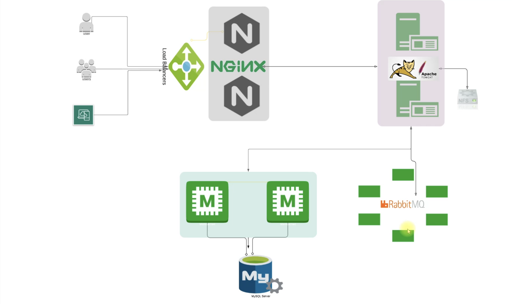
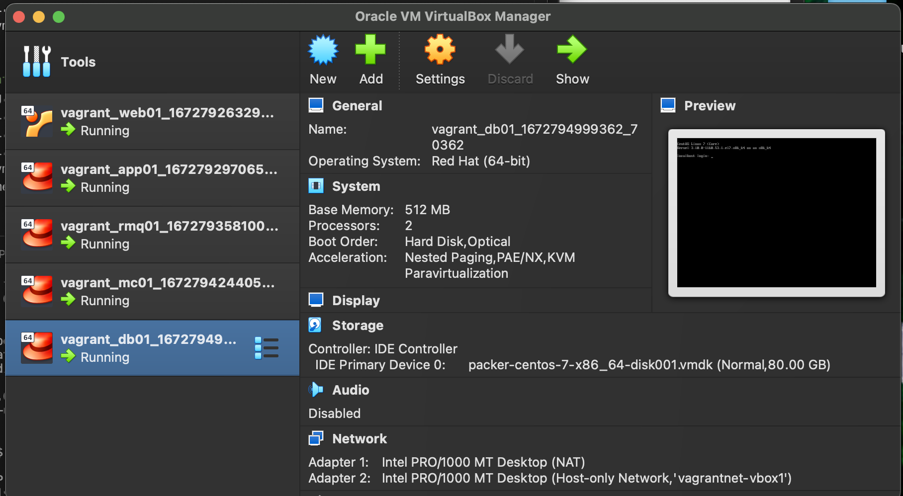
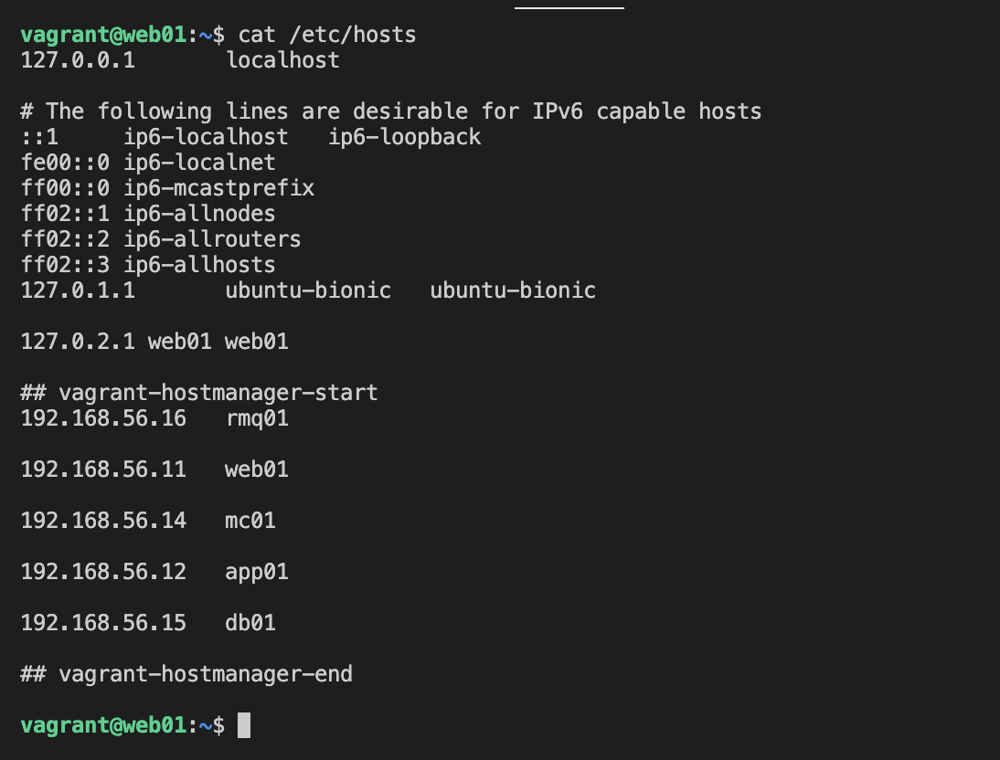
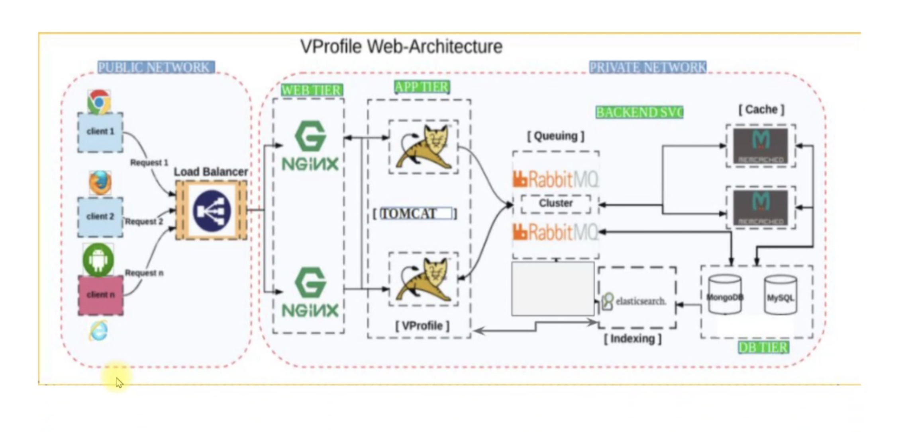
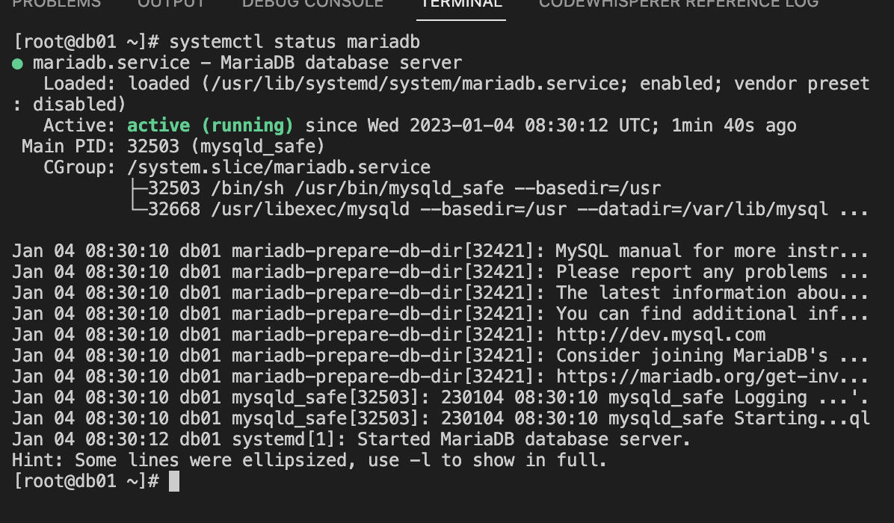
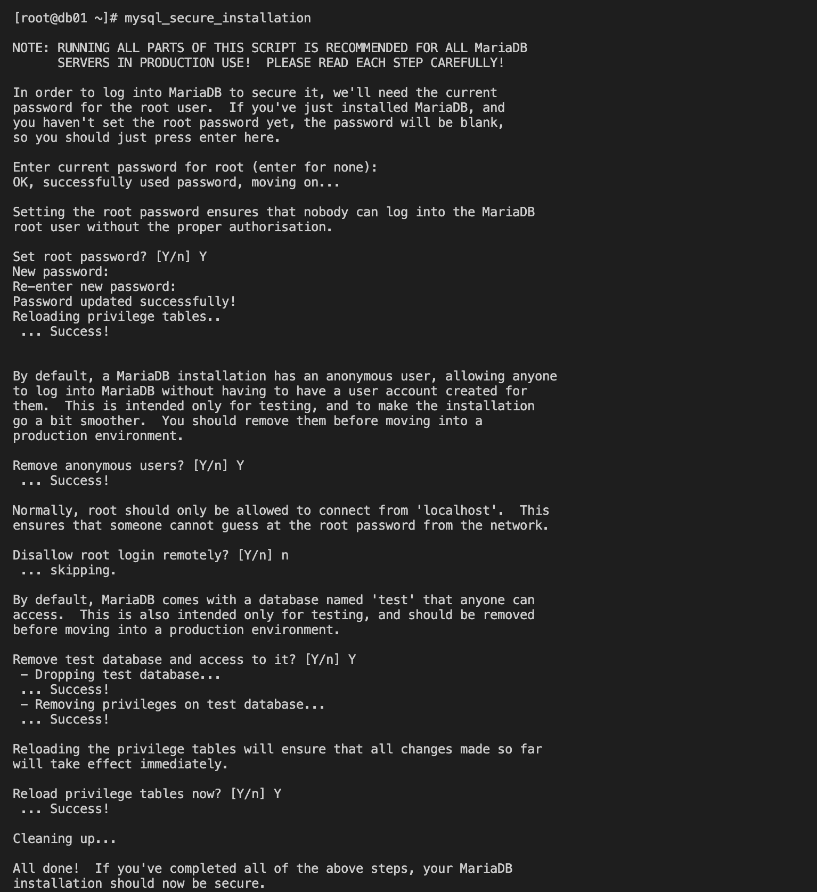

# Multi Tier Web Application Setup On A Local Machine Using A Manual Process
##  Prerequisite

1. Oracle VM Virtualbox
2. Vagrant
3. Vagrant plugins
    + vagrant plugin install vagrant-hostmanager
    + vagrant plugin install vagrant-vbguest
4. Git bash or equivalent editor

##  System Architecture

  + The architecture basically deploy multi tier application which include:- NGINX, Apache Tomcat, RabbitMQ, Memcached and MySql servers on a virtual box manually. Explanation of each includes -
    + **Load balancer** - Provides an IP address to access the web application
    + **NGINX** - A server for load balancing experience that routes request to a web server e.g:- Apache Tomcat Server
    + **Apache Tomcat** - A web server that hosts Java based application alone. This is where the code which the developers built sits.
    + **RabbitMQ** - A message broker (Queuing agent) for the application
    + **MySql** - A database where data are being queried
    + **Memcached** - A database cache connected to MySql to cache data for easy retrieval after the first request is made from the database itself in our case MySql

##  Steps
### Virtual Machine Setup
+ Change your directory to `vagrant`.
      
      cd vagrant
+ Running `vagrant up` will launch five different virtual box each containing different services (Nginx, Tomcat, RabbitMQ, MySql database and Memcached)

      vagrant up
+ Now we can verify our virtual machines provisioned by checking our virtualbox manager. We have all in running state which we can then `ssh` into each of them:-
  

+ Let's get into web01 virtual machine with ssh form the vagrant directory

      vagrant ssh web01
+ While in the virtualbox, we can verify if all virtual machine are connected by checking the `/etc/hosts` file.

  

+ We follow the same process to ssh into other virtual machines (app01, rmq01, mc01, db01) to cerify if they are all connected. We can as well ping other virtual machine form the current machine.

### Service Provisioning On Each Virtual Machine (Nginx - Web Service, Tomcat - Application Server, RabbitMQ - Broker/Queuing Agen, Memcache - DB Caching, MySQL - SQL Database)

####  - SQL Database Setup
  + Login to the db vm while still in the vagrant directory.

        vagrant ssh db01
  + We can then verify Hosts entry, if entries missing update the it with IP and hostnames by running the command - 

        cat /etc/hosts
  + Switch to root user to install all dependencies by runnning

        sudo -i
  + Update OS with latest patches by running

        yum update -y
  
  + First we will set our db password using DATABASE_PASS environment variable and add it to /etc/profile file because we will be using it to log into our Mariadb server

        DATABASE_PASS='admin123'
  + This variable will be temporary, to make it permanent we need to add it /etc/profile file and update file.

        vi /etc/profile
        source /etc/profile
  + Set Repository by running

        yum install epel-release -y
  + Install Maria DB and git Package

      yum install git mariadb-server -y
  + Now let's start & enable mariadb-server

        systemctl start mariadb
        systemctl enable mariadb
  + Check the status of mariadb service which must be in a running state

        systemctl status mariadb
      
      

  + Run mysql secure installation script on the terminal. NOTE: Set db root password, I will be using admin123 as password.

        mysql_secure_installation
      
  + We can now login into the Mariadb using the command since we set the password to admin123

        mysql -u root -padmin123
  + Next we 
  + Create a database account by running the following commands