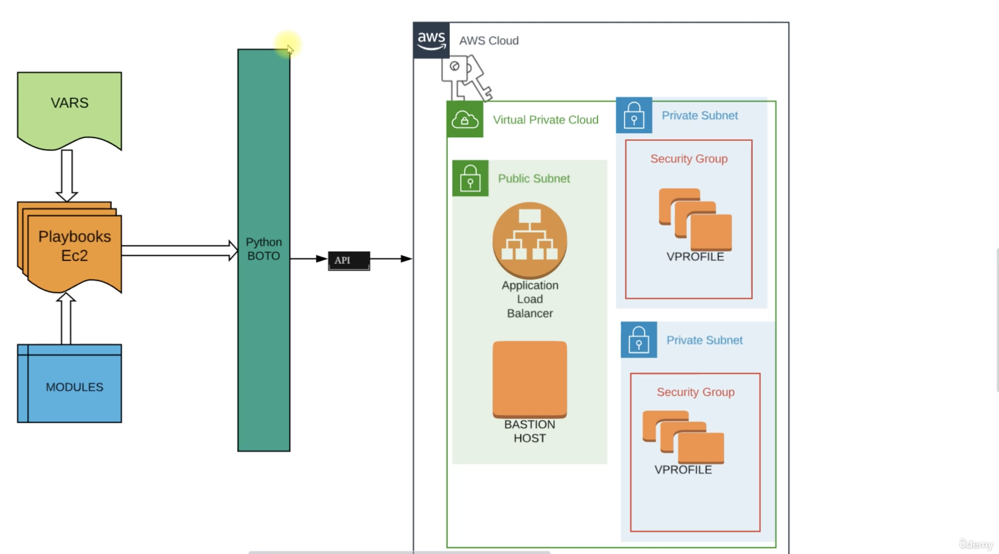
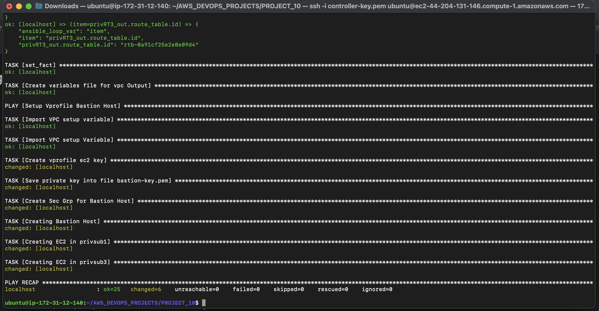
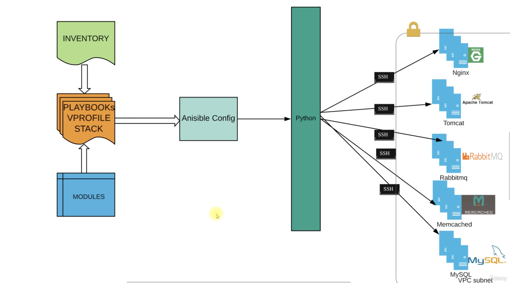

# ANSIBLE FOR COMPLETE STACK SETUP (V PROFILE)

##  Pre-Requisite
+   AWS account
+   Ansible
+   IDE (Sublime, Vscode)
+   Github account, Git 

##  The following setup must be done after the provision of [VPC](https://github.com/sadebare/AWS_DEVOPS_PROJECTS/tree/main/PROJECT_9)
##  FIRST PHASE SETUP SYSTEM DESIGN

### During this phase, we will be using ansible playbook to configure multiple ec2 for our vprofile application setup and load balancer

+ First we will be merging the bastion variable to the vpc setup variable
+ Create a new file called [site.yml](./site.yml) with the following content

      ---
      - import_playbook: vpc-setup.yml
      - import_playbook: bastion-instance.yml
+ Launch an EC2 instance to install ansible and fetch the code to run

      AMI: Ubuntu 20.04
      Instance type: t2.micro
      security group: port 22
      user data:
      ------------------------
      #!/bin/bash
      sudo apt update
      sudo apt install ansible -y

+ Now, we can login to the just initiated instance and attach the IAM role created while creating the VPC to the instance to allow our ansible instance have full access to all our aws services

      ansible --version
      sudo apt install python3-boto3 python3-botocore python3-boto -y
      git clone https://github.com/sadebare/AWS_DEVOPS_PROJECTS.git
      cd AWS_DEVOPS_PROJECTS/PROJECT_10/
      ansible-playbook site.yml
  
  

+ Create a new file `vpro-ec2-stack.yml` using the code editor

      

## SECOND PHASE SETUP SYSTEM DESIGN

### Finally, we get to setup our playbook to setup our vprofile stack
