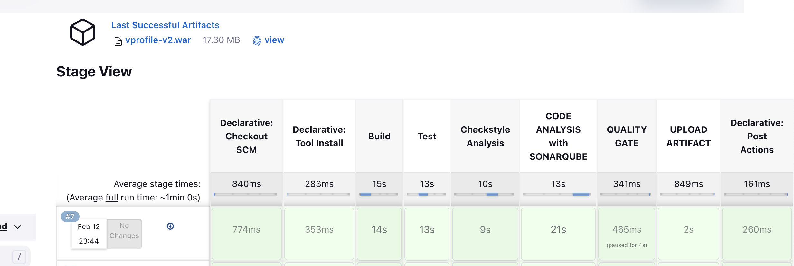
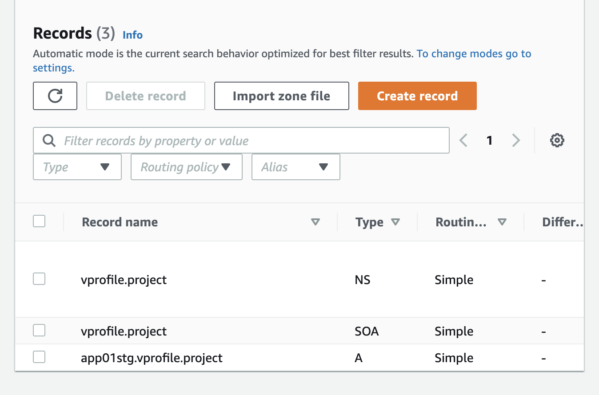
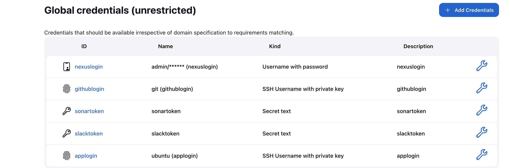
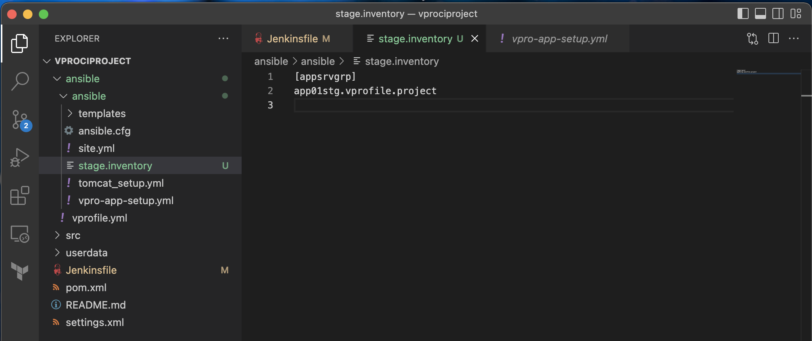
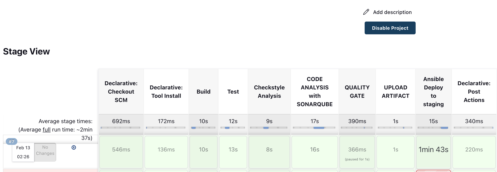
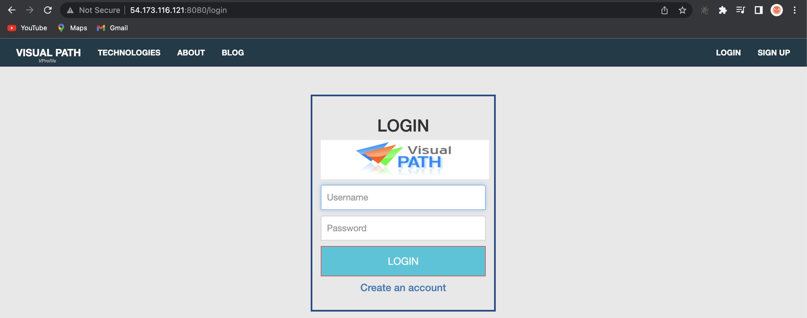

# CONTINUOUS DELIVERY USING JENKINS AND ANSIBLE ON AMAZON WEB SERVICE (AWS)

# Prerequisite
  + Git
  + Github
  + AWS account
  + Ansible
  + Jenkins server from [Project-5](https://github.com/sadebare/AWS_DEVOPS_PROJECTS/tree/main/PROJECT_5)
  + Sonarqube server from [Project-5](https://github.com/sadebare/AWS_DEVOPS_PROJECTS/tree/main/PROJECT_5)
  + Nexus server from [Project-5](https://github.com/sadebare/AWS_DEVOPS_PROJECTS/tree/main/PROJECT_5)

  ##  SYSTEM DESIGN - Continuation of [Project-5](https://github.com/sadebare/AWS_DEVOPS_PROJECTS/tree/main/PROJECT_5)
  

### Step 1: Continuous Integration And Webhook
  + Log into your AWS console, then navigate to the EC2 services provisioned in [Project-5](https://github.com/sadebare/AWS_DEVOPS_PROJECTS/tree/main/PROJECT_5) and increase the volume of jenkins server from the default 8GB to 15GB because we will be installing ansible on it.
  + Power on all the three instance which are stopped (Jenkins, Sonarqube and Nexus)
  + Get the jenkins public IP address and update the project repo webhook for the jenkins trigger
  + Login to the jenkins server through the URL '<public-ip>:8080' and run the build again for confirmation.
    

### Step 2: Prepare Application Server Staging
  + Launch the an ubuntu EC2 server with the following spec. for app server

        Name: app01-staging
        AMI: ubuntu 18.04 LTS
        Instance type: t2.micro
        Security group: 22 from myIP, 8080 from myIP and 22 from jenkins-sg
  + Note the private IP address of the app server just created and navigate to Route53 > create hosted zone

        Domain name: vprofile.project
        Type: Private hosted zone
        Region: US East (N. Virginia) [us-east-1]
    
  + After creating an hosted zone, we can then create A record in it

        Record name: app01stg
        Value: <app-provate-ip>
  + Add the app SSH login key in the jenkins credential [manage jenkins -> manage credentials]

        kind: SSH Username with private key
        ID: applogin
        username: ubuntu
        private key: <copy-key-created-for-app-server>
  

### Step 3: Ansible in jenkins
  + SSH into jenkins instance and run the ffg commands to install ansible

        sudo -i
        sudo apt update
        sudo apt install software-properties-common
        sudo add-apt-repository --yes --update ppa:ansible/ansible
        sudo apt install ansible -y
        ansible --version

  + Now, let us install ansible plugin from jenkins user interface

        manage jenkins -> manage plugins -> available -> ansible -> install without restart

### Step 4: Prepare source code
  + Go to your local repository for vprofileciproject.This is a private repository we created in Project-5. We will create a new branch fromci-jenkins branch and call it as cicd-jenkins-ansible.

      git checkout ci-jenkins
      git checkout -b cicd-jenkins-ansible
  
  + We will add code from jenkins-ansible-code branch of https://github.com/sadebare/vprofile-project repository. Download zip from this branch.We will extract and copy ansible directory under our local vprofileciproject directory when we are in cicd-jenkins-ansible branch.

        git add .
        git commit -m "adding ansible code"
        git push origin cicd-jenkins-ansible

### Step 5: Tomcat playbook
  + In this step, we prepare our playbooks to deploy our artifact to Tomcat server. Under ansible/ directory we have templates folder which have files to setup systemd file for Tomcat in different OS.

  + Then we use those in our tomcat_setup.yml playbook to setup our Tomcat server, After setup is complete, Ansible will run vpro-app-setup.yml to deploy our application.

### Step-6: Jenkinsfile & Inventory
  + We uploaded ansible/ directory with files in our vprofileciproject repository. Now we will update our Jenkinsfile to use those playbooks.

               stage('Ansible Deploy to staging'){
                  steps {
                      ansiblePlaybook([
                      inventory   : 'ansible/stage.inventory',
                      playbook    : 'ansible/site.yml',
                      installation: 'ansible',
                      colorized   : true,
                credentialsId: 'applogin',
                disableHostKeyChecking: true,
                      extraVars   : [
                          USER: "admin",
                          PASS: "${NEXUSPASS}",
                    nexusip: "172.31.5.4",
                    reponame: "vprofile-release",
                    groupid: "QA",
                    time: "${env.BUILD_TIMESTAMP}",
                    build: "${env.BUILD_ID}",
                          artifactid: "vproapp",
                    vprofile_version: "vproapp-${env.BUILD_ID}-${env.BUILD_TIMESTAMP}.war"
                      ]
                  ])
                  }
              }

          }
  + In our playbooks we have use below values. Now we will create an inventory file to define those servers.

         hosts: appsrvgrp
         app01stg.vprofile.project
  + In vprofileciproject repository, under ansible directory, we will create stage.inventory file. Instead of IP address, we will use the DNS record we created in Route53 like below.

        
  + Before updating our Jenkinsfile, we need to add another credential to Jenkins for nexus password.

        Type: Secret text
        Secret: <pass-your-nexus-password>
        ID: nexuspass
        description nexuspass
  + We create a Jenkinsfile for this job and push it to vprofileciproject repository.
  + We need to go to AWS console and add a Inbound rule to Nexus  server.

        Allow on port 8081 from app-SG (since app server will download the artifact from Nexus)
  + Create a pipeline in Jenkins, call it as cicd-jenkins-ansible-stage.

        Build Trigger: GitSCM pollong
        Pipeline from: SCM
        Git
        URL: SSH url of vprofileci project 
        Credentials: githublogin
        Branch: cicd-jenkins-ansible
  + We need to go to Jenkins, Manage Jenkins -> Configure System. Here under Build Timestap we need to give format as yy-MM-dd_HHmm. Save it.
  + Now we can trigger our pipeline.
  
  + We can also check from browser if application working properly. '<app-ip>:8080'
  

### Step 6: Prepare App-Server for Prod
  + In this step, we are deploying only for one instance. But we can deploy application to many servers as well just by adding the server names to under appsrvgrp in inventory file we created as below:

        [appsrvgrp]
        app01stg.vprofile.project
  + We will launch an EC2 instance with below details.

        Name: app01-prod
        AMI: Ubuntu 18.04
        InstanceType: t2.micro
        Keypair: Create a new .pem keypair for prod
        SecGrp: app-SG
  + Once our Hosted Zone is created we will create an A Record by using private_ip_of_app_prod_server in vprofile.project Private Hosted Zone.
  + Go to Jenkins Manage Jenkins -> Credentials -> global. Ansible will use this credential to SSH into App server.

        Type SSH login with private key
        ID: applogin-prod
        description: applogin-prod
        user: ubuntu
        Private Key: copy the content from app-key-prod.pem
### Step 7: Jenkinsfile for Prod
  + We will go to our local repository and create a new branch like below. Open it in VS Code.

        git checkout cicd-jenkins-ansible
        git checkout -b cicd-jenkins-ansible-prod
        code .
  + First we rename the inventory as prod.inventory and add DNS record for prod.
  + Then we create a new Jenkinsfile as below. We remove many stages in this file, since we will use an artifact which is already deployed to stage env and well-tested there before prod deployment. Below is the new Jenkinsfile content:

        def COLOR_MAP = [
            'SUCCESS': 'good', 
            'FAILURE': 'danger',
        ]
        pipeline {
            agent any

            environment {        
                NEXUSPASS = credentials('nexuspass')
            }

            stages {

                stage('Setup parameters') {
                    steps {
                        script { 
                            properties([
                                parameters([
                                    string(
                                        defaultValue: '', 
                                        name: 'BUILD', 
                                    ),
                      string(
                                        defaultValue: '', 
                                        name: 'TIME', 
                                    )
                                ])
                            ])
                        }
                    }
            }
                
                stage('Ansible Deploy to Prod'){
                    steps {
                        ansiblePlaybook([
                        inventory   : 'ansible/prod.inventory',
                        playbook    : 'ansible/site.yml',
                        installation: 'ansible',
                        colorized   : true,
                  credentialsId: 'applogin-prod',
                  disableHostKeyChecking: true,
                        extraVars   : [
                            USER: "admin",
                            PASS: "${NEXUSPASS}",
                      nexusip: "172.31.5.4",
                      reponame: "vprofile-release",
                      groupid: "QA",
                      time: "${env.TIME}",
                      build: "${env.BUILD}",
                            artifactid: "vproapp",
                      vprofile_version: "vproapp-${env.BUILD}-${env.TIME}.war"
                        ]
                    ])
                    }
                }

            }
            post {
                always {
                    echo 'Slack Notifications.'
                    slackSend channel: '#jenkinscicd',
                        color: COLOR_MAP[currentBuild.currentResult],
                        message: "*${currentBuild.currentResult}:* Job ${env.JOB_NAME} build ${env.BUILD_NUMBER} \n More info at: ${env.BUILD_URL}"
                }
            }
        }
  + Create a new pipeline in Jenkins like below and save it.

        Name: cicd-jenkins-ansible-prod
        Kind: Pipeline
        Copy from: cicd-jenkins-ansible-stage
        ### We only need to update branch in this setup ###
        Branch: cicd-jenkins-ansible-prod
  + Refresh the page to see Build with Parameters option. You may need to Build Now and Cancel if it does not show.
  + We setup the pipeline with user input, we need to specify exactly which Build artifact should be deployed to Prod from Nexus.
  + We get the exact artifact from Nexus with Build # and Time.
  
  + We can also verify from browser that our application successfully deployed to prod server.
    