# Project-13: Java App Deployment on Kubernetes Cluster
##  Pre-requisite
+ AWS account
+ Kubernetes setup using KOPS
+ Registered DNS records and name

## - KOPS Setup 
### Step 1: Create an EC2 instance

      Name: kops
      AMI: Ubuntu 20.04
      InstanceType: t2.micro
      SecGrp: allow SSH on port 22 from MyIP
      KeyPair: create a new keypair

### Step 2: Create S3 bucket
  + We will create an S3 bucket to store Kops state. As long as we point our s3 bucket with kops state file, we can run kops command from anywhere.

        Name: barry-vprofile-kops-state

### Step 3: Create IAM user
  + This user will be used for AWSCLI Programmatic access.
  + Name: kopsadmin Policy: AdministratorAccess (you can specifiy only necessary permissions as well for best-practice)

### Step 4: Create Route53 HostedZone
+ We will create a Public hosted in Route53. Then we will add its NS records to our Domain registerer. My registered domain name: `barrydevops.com`. I will create a hostedzone with below name.

      Name: kubeapp.barrydevops.com
+ We will be creating 4 NS values to our Registered domain as NS Record.
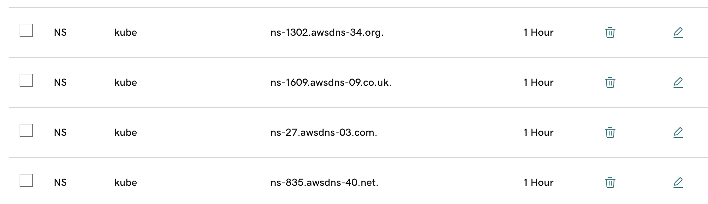
### Step 5: Login Ec2 and configure awscli
+ SSH into your kops instance with your newly created pem key.
+ First we will create an SSH-key which will be used for kops. Public key will be pushed to all other instances automatically.

      ssh-keygen
+ Next we will install awscli and configure it with kopsadmin access credentials.

      sudo apt update && sudo apt install awscli -y
      aws configure
### Step 6: Setup kOps Cluster
+ As per Kubernetes official documentation, we need to install kubectl and kops. Follow steps from [documentation](https://kubernetes.io/docs/setup/production-environment/tools/kops/).Once installation steps are complete, run below commands to check if they are ready to use.

      kops version
      kubectl version --client
+ Next we need to verify domain we have created in Route53.

      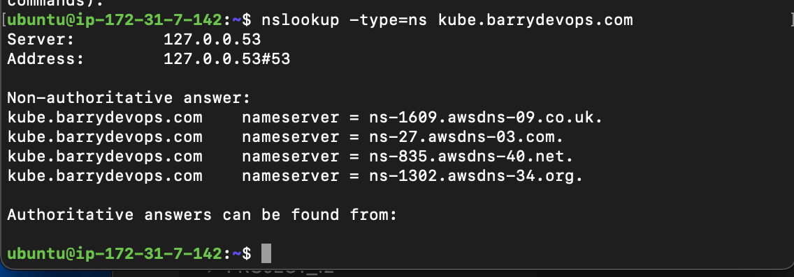
+ Now we will run kops command which will create kops cluster.(Note: Don't forget to replace your domain name and s3 bucket name in the command.) Below command won't create cluster, it will create configuration of cluster.

      kops create cluster --name=kube.barrydevops.com \
      --state=s3://barry-vprofile-kops-state --zones=us-east-1a,us-east-1b \
      --node-count=1 --node-size=t3.small --master-size=t3.medium \
      --dns-zone=kube.barrydevops.com  \
      --node-volume-size=8 --master-volume-size=8
+ We can create cluster with below command, we need to specify the s3 bucket we use for state config.

      kops update cluster --name kube.barrydevops.com --state=s3://barry-vprofile-kops-state --yes --admin
+ After issuing thsi command, wait 10-15 minutes before validating the cluster with below command:

      kops validate cluster --state=s3://barry-vprofile-kops-state
  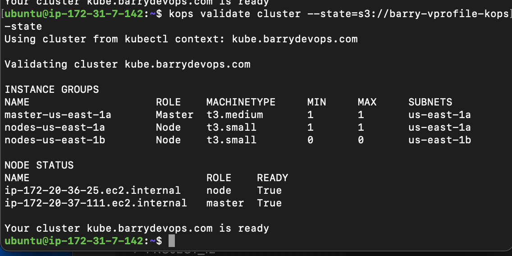
+ Validate our cluster using `kubectl` command
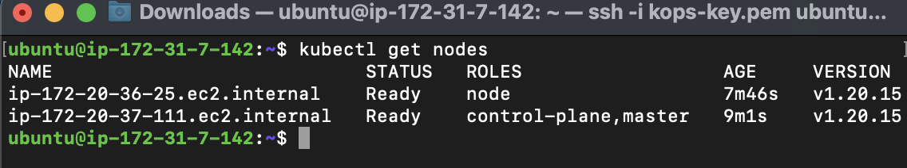
### Step 7: Create Volume for DB Pod
+ We need to create an EBS volume to store mySQL data. Use below command to create one.

      aws ec2 create-volume \
      --availability-zone us-east-1a \
      --size 3 \
      --volume-type gp2
  

+ Next, I will label the nodes with zone=us-east-1a. We need to make sure that we are running our DB pod in the same zone our EBS volume created. For this reason we will create labels for our nodes.
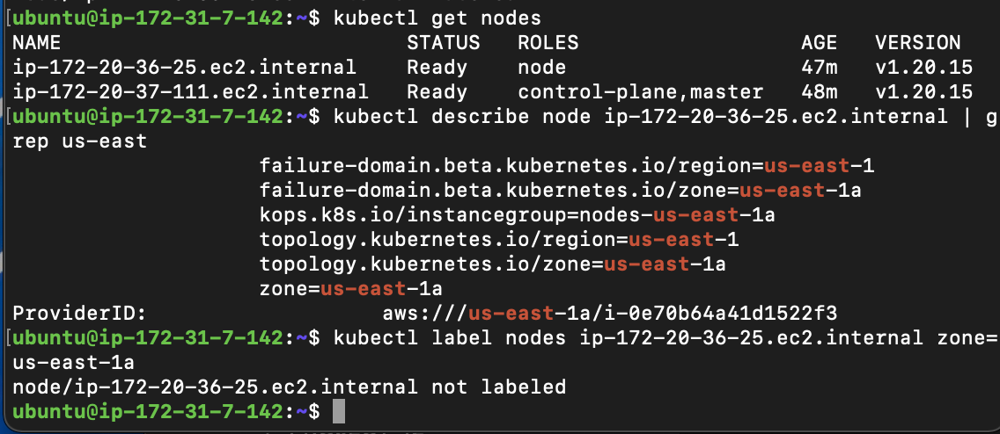

### Step 8: Source Code Review
+ You can find all kubernetes manifest files by cloning this repository.Clone this repo to your ec2. Make necessary changes in files, before applying kubectl commands.

      https://github.com/sadebare/kube-app
+ In Project-12, we have Containerized the vprofile application and push it to the DockerHub. We will use the images below with :V1 tag from DockerHub repository in our Kubernetes manifests.
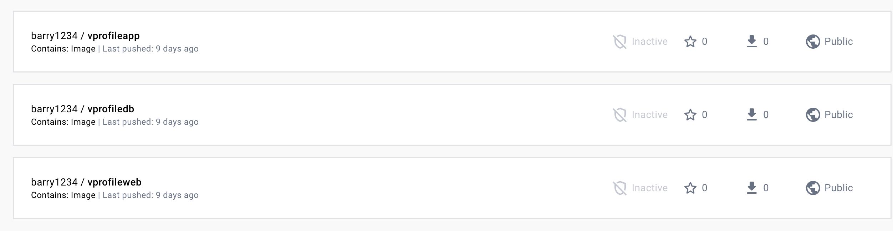
+ Our vprofile application is using below application.properties file. We need to create Kubernetes services with the same name given in this file for application to connect them.

      #JDBC Configutation for Database Connection
      jdbc.driverClassName=com.mysql.jdbc.Driver
      jdbc.url=jdbc:mysql://vprodb:3306/accounts?useUnicode=true&characterEncoding=UTF-8&zeroDateTimeBehavior=convertToNull
      jdbc.username=root
      jdbc.password=vprodbpass

      #Memcached Configuration For Active and StandBy Host
      #For Active Host
      memcached.active.host=vprocache01
      memcached.active.port=11211
      #For StandBy Host
      memcached.standBy.host=vprocache02
      memcached.standBy.port=11211

      #RabbitMq Configuration
      rabbitmq.address=vpromq01
      rabbitmq.port=15672
      rabbitmq.username=guest
      rabbitmq.password=guest

      #Elasticesearch Configuration
      elasticsearch.host =vprosearch01
      elasticsearch.port =9300
      elasticsearch.cluster=vprofile
      elasticsearch.node=vprofilenode
### Step 9: Kube secret for passwords
+ In application.properties file, we have db password and rabbitMQ password. We will encode these values and create a K8s secret file as in given under kubernetes directory.
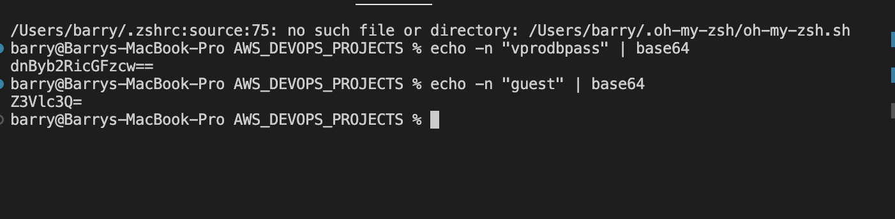
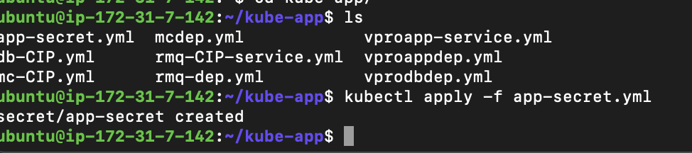

### Step 10: DB Deployment&Service Definition
+ Create a K8s DB deployment and service file as in given under kubernetes directory.

    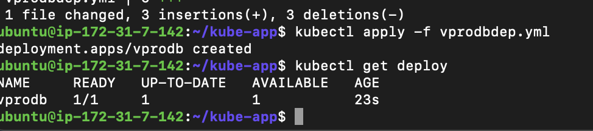
### Step 11: Memcached Deployment&Service Definition
+ Create a K8s MC deployment and ClusterIP type service file as in given under kubernetes directory.Run below commands to create files:

      kubectl apply -f mcdep.yml
      kubectl apply -f mc-CIP.yml
### Step 12: RabbitMQ Deployment&Service Definition
+ Create a K8s RMQ deployment and ClusterIP type service file as in given under kubernetes directory.Run below commands to create files:

      kubectl apply -f rmq-dep.yml
      kubectl apply -f rmq-CIP.yml
+ We can check the resources created with below command:

      kubectl get all
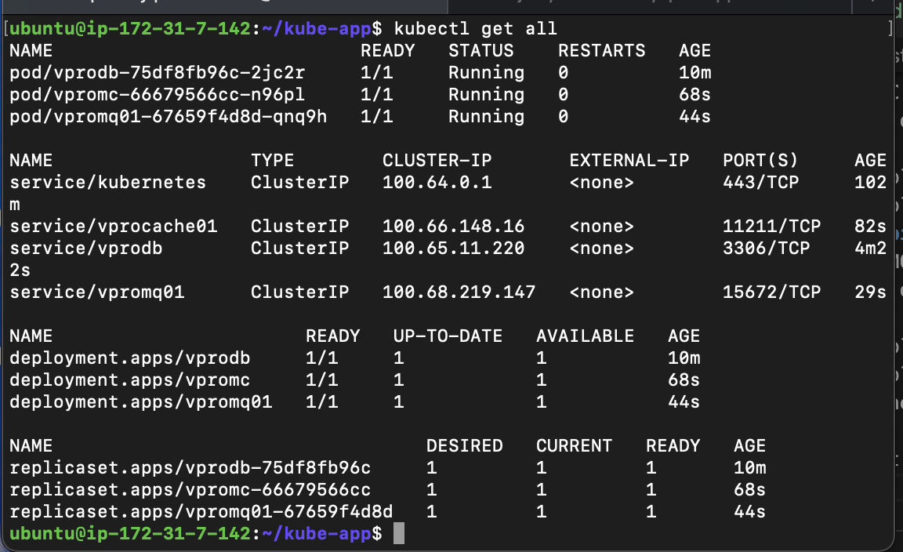

### Step 13: Application Deployment&Service Definition
+ Create a K8s Application deployment and LoadBalancer type service file as in given under kubernetes directory.Run below commands to create files:

      kubectl apply -f vproapp-dep.yml
      kubectl apply -f vproapp-svc.yml

### Step 14: Create Route53 Record for Application LoadBalancer
+ We will create a A record with Alias to Load balancer.
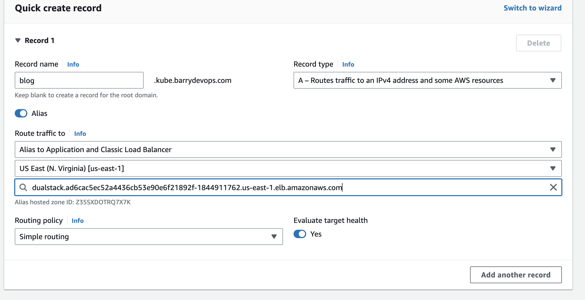
+ Lets validate our application from browser with our new dns name.
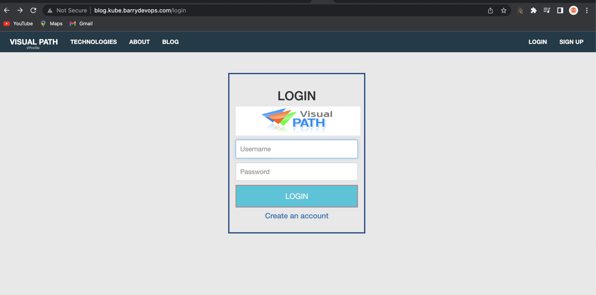
+ We validated DB by successfully logging in with admin_vp/admin_vp username&pwd.
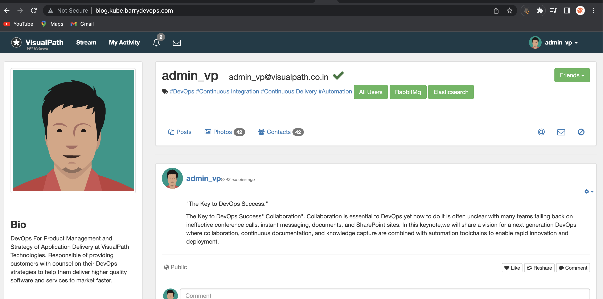
+ We can validate RabbitMQ service.
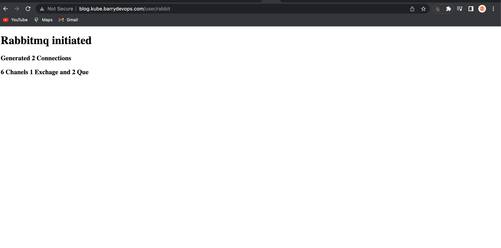
+ Lastly, we can verify our memcached service.
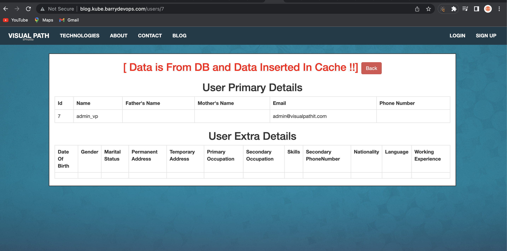

### Step 15: Cleanup
+ We will start with deleting our kubernetes services first. Then we will delete our cluster, s3 bucket, Route53 Hosted zone.

      Kops delete cluster --name=kube.barrydevops.com --state=s3://barry-vprofile-kops-state --yes