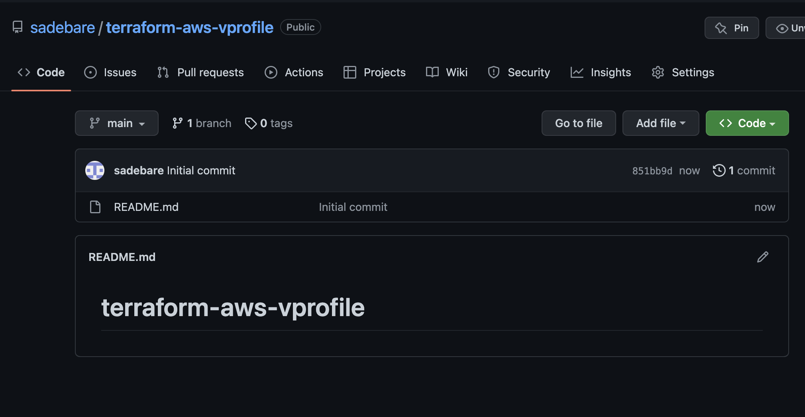

# TERRAFORM FOR CLOUD STATE MANAGEMENT
##  SYSTEM DESIGN

##  Pre-requisites
+ AWS Account
+ GitHub account
+ Terraform, Maven, JDK installed locally
+ IDE (VS Code, IntelliJ, etc)

##  Step 1: Create a Github repository
+ Create a repo in GitHub and name it as `terraform-aws-vprofile`. Keeping the repository public since we will not be storing our credential in the repository, but if we are to store our credentials, then we go for the private repository.

##  Step 2: Clone the source code to local
+ We will clone the repository to the IDE that we will be using. I will be using VsCode for this project.

##  Step 3: Terraform Setup
+ 