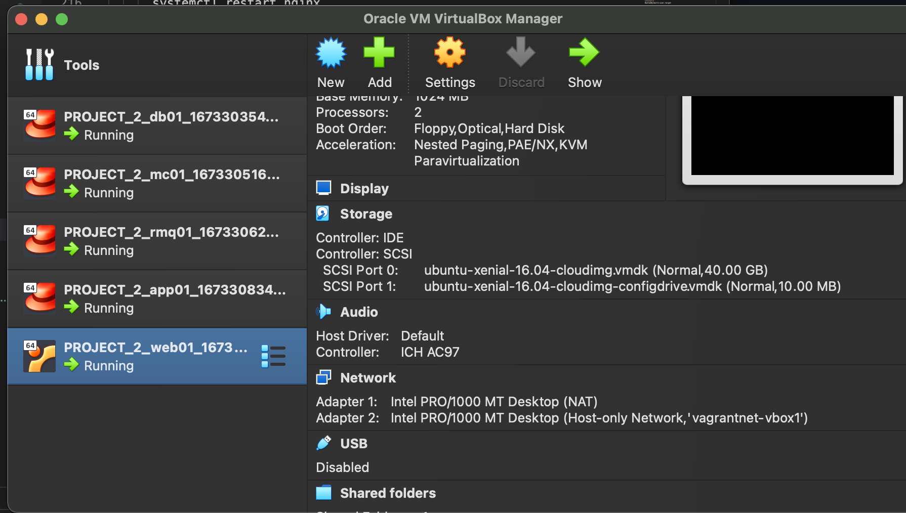
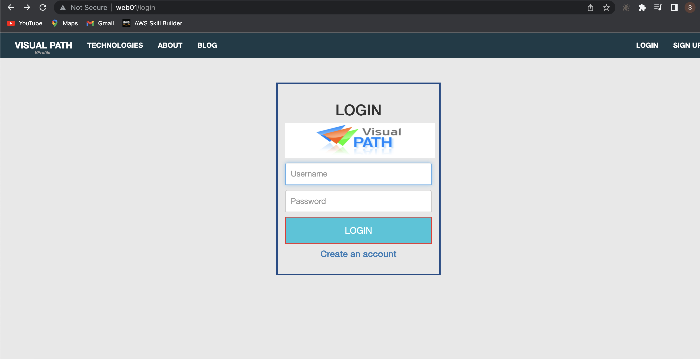
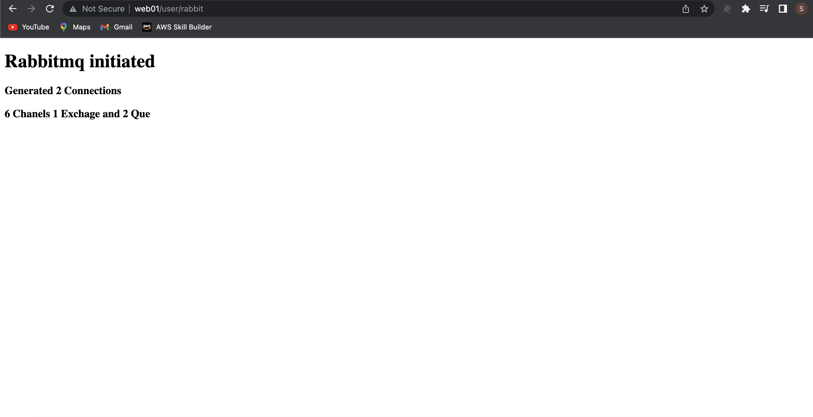
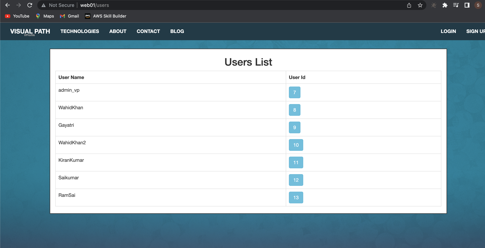
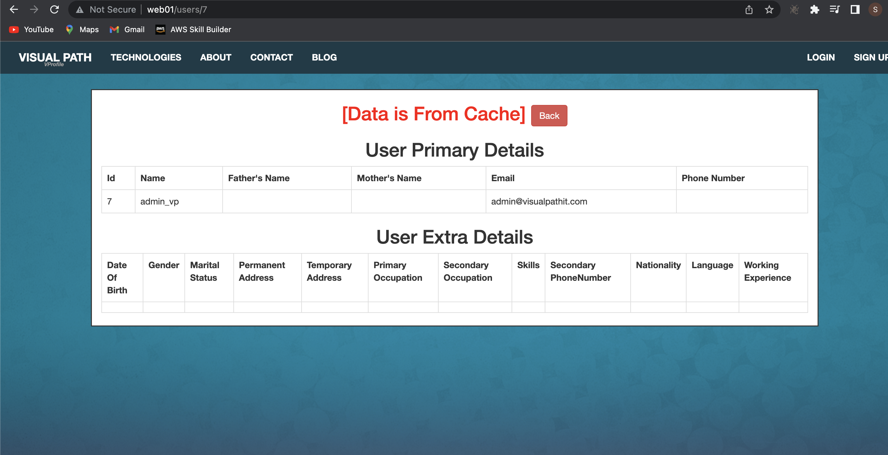

# Automated setup of Multi Tier Application

This is a follow up project from [project 1](https://github.com/sadebare/AWS_DEVOPS_PROJECTS/tree/main/PROJECT_1) to setup our application automatically using a bash script to hasten the provisioning and configuration of our virtual machines.

##  Prerequisite

1. Oracle VM Virtualbox
2. Vagrant
3. Vagrant plugins
    + vagrant plugin install vagrant-hostmanager
    + vagrant plugin install vagrant-vbguest
4. Git bash or equivalent editor (sublime, vscode or others)

## Steps

### Step 1
  + Bash scripting that initializes the database (dd), set password and set firewall rules in the file [mysql.sh](./mysql.sh)

        #!/bin/bash
        DATABASE_PASS='admin123'
        sudo yum update -y
        sudo yum install epel-release -y
        sudo yum install git zip unzip -y
        sudo yum install mariadb-server -y

        # starting & enabling mariadb-server
        sudo systemctl start mariadb
        sudo systemctl enable mariadb
        cd /tmp/
        git clone -b local-setup https://github.com/devopshydclub/vprofile-project.git
        #restore the dump file for the application
        sudo mysqladmin -u root password "$DATABASE_PASS"
        sudo mysql -u root -p"$DATABASE_PASS" -e "UPDATE mysql.user SET Password=PASSWORD('$DATABASE_PASS') WHERE User='root'"
        sudo mysql -u root -p"$DATABASE_PASS" -e "DELETE FROM mysql.user WHERE User='root' AND Host NOT IN ('localhost', '127.0.0.1', '::1')"
        sudo mysql -u root -p"$DATABASE_PASS" -e "DELETE FROM mysql.user WHERE User=''"
        sudo mysql -u root -p"$DATABASE_PASS" -e "DELETE FROM mysql.db WHERE Db='test' OR Db='test\_%'"
        sudo mysql -u root -p"$DATABASE_PASS" -e "FLUSH PRIVILEGES"
        sudo mysql -u root -p"$DATABASE_PASS" -e "create database accounts"
        sudo mysql -u root -p"$DATABASE_PASS" -e "grant all privileges on accounts.* TO 'admin'@'localhost' identified by 'admin123'"
        sudo mysql -u root -p"$DATABASE_PASS" -e "grant all privileges on accounts.* TO 'admin'@'%' identified by 'admin123'"
        sudo mysql -u root -p"$DATABASE_PASS" accounts < /tmp/vprofile-project/src/main/resources/db_backup.sql
        sudo mysql -u root -p"$DATABASE_PASS" -e "FLUSH PRIVILEGES"

        # Restart mariadb-server
        sudo systemctl restart mariadb

        #starting the firewall and allowing the mariadb to access from port no. 3306
        sudo systemctl start firewalld
        sudo systemctl enable firewalld
        sudo firewall-cmd --get-active-zones
        sudo firewall-cmd --zone=public --add-port=3306/tcp --permanent
        sudo firewall-cmd --reload
        sudo systemctl restart mariadb

### Step 2
+ We created a bash script for the memcache service which install the service and make sure it is up and running:- file [memcache.sh](./memcache.sh)

      #!/bin/bash
      sudo yum install epel-release -y
      sudo yum install memcached -y
      sudo systemctl start memcached
      sudo systemctl enable memcached
      sudo systemctl status memcached
      sudo memcached -p 11211 -U 11111 -u memcached -d

### Step 3
+ Create a bash script for rabbitmq service to install and enable the service in vm:- file [rabbitmq.sh](./rabbitmq.sh)

      #!/bin/bash
      sudo yum install epel-release -y
      sudo yum update -y
      sudo yum install wget -y
      cd /tmp/
      wget http://packages.erlang-solutions.com/erlang-solutions-2.0-1.noarch.rpm
      sudo rpm -Uvh erlang-solutions-2.0-1.noarch.rpm
      sudo yum -y install erlang socat
      curl -s https://packagecloud.io/install/repositories/rabbitmq/rabbitmq-server/script.rpm.sh | sudo bash
      sudo yum install rabbitmq-server -y
      sudo systemctl start rabbitmq-server
      sudo systemctl enable rabbitmq-server
      sudo systemctl status rabbitmq-server
      sudo sh -c 'echo "[{rabbit, [{loopback_users, []}]}]." > /etc/rabbitmq/rabbitmq.config'
      sudo rabbitmqctl add_user test test
      sudo rabbitmqctl set_user_tags test administrator
      sudo systemctl restart rabbitmq-server

### Step 4
+ We then move on by creating a bash script for our application - Tomcat service installed, set up our application, build artifact and deploy. File - [tomcat.sh](./tomcat.sh)

      TOMURL="https://archive.apache.org/dist/tomcat/tomcat-8/v8.5.37/bin/apache-tomcat-8.5.37.tar.gz"
      yum install java-1.8.0-openjdk -y
      yum install git maven wget -y
      cd /tmp/
      wget $TOMURL -O tomcatbin.tar.gz
      EXTOUT=`tar xzvf tomcatbin.tar.gz`
      TOMDIR=`echo $EXTOUT | cut -d '/' -f1`
      useradd --shell /sbin/nologin tomcat
      rsync -avzh /tmp/$TOMDIR/ /usr/local/tomcat8/
      chown -R tomcat.tomcat /usr/local/tomcat8

      rm -rf /etc/systemd/system/tomcat.service

      cat <<EOT>> /etc/systemd/system/tomcat.service
      [Unit]
      Description=Tomcat
      After=network.target

      [Service]

      User=tomcat
      Group=tomcat

      WorkingDirectory=/usr/local/tomcat8

      #Environment=JRE_HOME=/usr/lib/jvm/jre
      Environment=JAVA_HOME=/usr/lib/jvm/jre

      Environment=CATALINA_PID=/var/tomcat/%i/run/tomcat.pid
      Environment=CATALINA_HOME=/usr/local/tomcat8
      Environment=CATALINE_BASE=/usr/local/tomcat8

      ExecStart=/usr/local/tomcat8/bin/catalina.sh run
      ExecStop=/usr/local/tomcat8/bin/shutdown.sh

      RestartSec=10
      Restart=always

      [Install]
      WantedBy=multi-user.target

      EOT

      systemctl daemon-reload
      systemctl start tomcat
      systemctl enable tomcat

      git clone -b local-setup https://github.com/devopshydclub/vprofile-project.git
      cd vprofile-project
      mvn install
      systemctl stop tomcat
      sleep 60
      rm -rf /usr/local/tomcat8/webapps/ROOT*
      cp target/vprofile-v2.war /usr/local/tomcat8/webapps/ROOT.war
      systemctl start tomcat
      sleep 120
      cp /vagrant/application.properties /usr/local/tomcat8/webapps/ROOT/WEB-INF/classes/application.properties
      systemctl restart tomcat

### Step 5
+ Create a file which contains all the properties for our `tomcat.sh` file to run by copying it to the root directory. File - [application.properties](./application.properties)

      #JDBC Configutation for Database Connection
      jdbc.driverClassName=com.mysql.jdbc.Driver
      jdbc.url=jdbc:mysql://db01:3306/accounts?useUnicode=true&characterEncoding=UTF-8&zeroDateTimeBehavior=convertToNull
      jdbc.username=admin
      jdbc.password=admin123

      #Memcached Configuration For Active and StandBy Host
      #For Active Host
      memcached.active.host=mc01
      memcached.active.port=11211
      #For StandBy Host
      memcached.standBy.host=127.0.0.2
      memcached.standBy.port=11211

      #RabbitMq Configuration
      rabbitmq.address=rmq01
      rabbitmq.port=5672
      rabbitmq.username=test
      rabbitmq.password=test

      #Elasticesearch Configuration
      elasticsearch.host =192.168.1.85
      elasticsearch.port =9300
      elasticsearch.cluster=vprofile
      elasticsearch.node=vprofilenode

### Step 6:
+ Create a bash script to install nginx acting as a load balancer. File - [nginx.sh](./nginx.sh)

      # adding repository and installing nginx		
      apt update
      apt install nginx -y
      cat <<EOT > vproapp
      upstream vproapp {

      server app01:8080;

      }

      server {

        listen 80;

      location / {

        proxy_pass http://vproapp;

      }

      }

      EOT

      mv vproapp /etc/nginx/sites-available/vproapp
      rm -rf /etc/nginx/sites-enabled/default
      ln -s /etc/nginx/sites-available/vproapp /etc/nginx/sites-enabled/vproapp

      #starting nginx service and firewall
      systemctl start nginx
      systemctl enable nginx
      systemctl restart nginx

### Step 7:
  + Create a Vagrantfile as done in [project 1](https://github.com/sadebare/AWS_DEVOPS_PROJECTS/tree/main/PROJECT_1) but in the file we automatically install all our dependency using bash scripting. File - [VagrantFile](./Vagrantfile)
  + A simple vagrant up will bring up all vm and install all the services in all accordingly.
  + After, we then validate our vm from the Virtualbox user interface
        

### Step 8:
  + Validate if our service are running by visiting the web application on the browser using it's ip address or hostname
        
  + Also Rabbitmq, memcache services
  
   
   
  + We then bring down all the vm running the command

        vagrant destroy