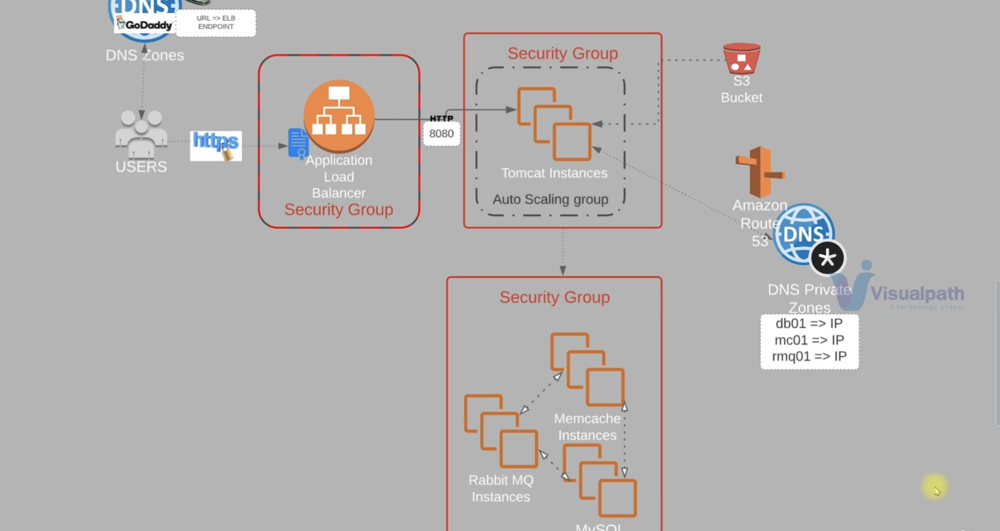
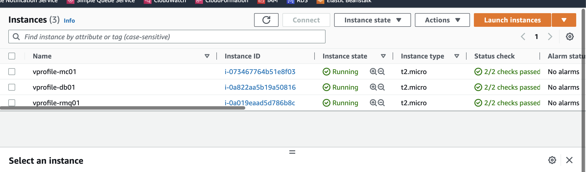
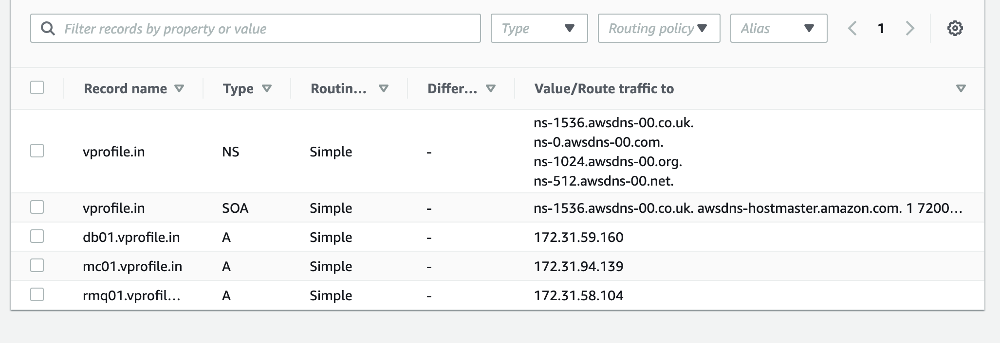
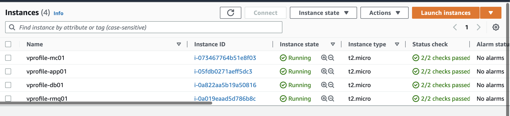
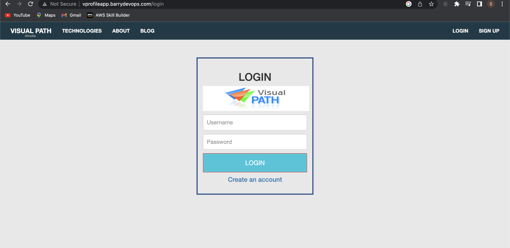
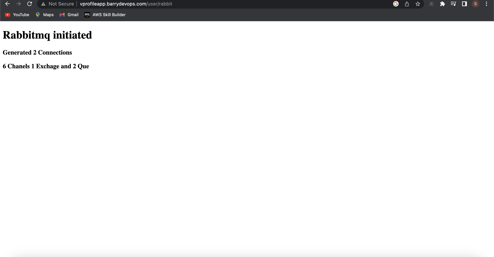
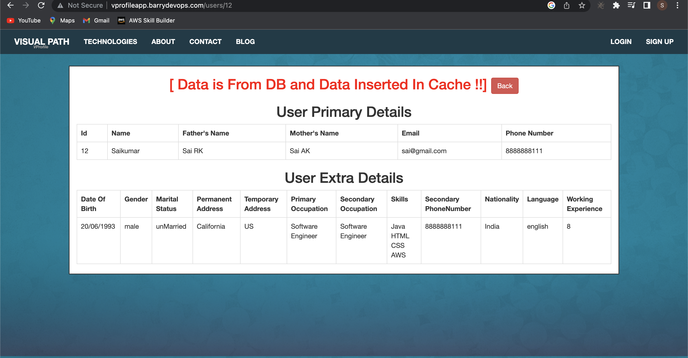
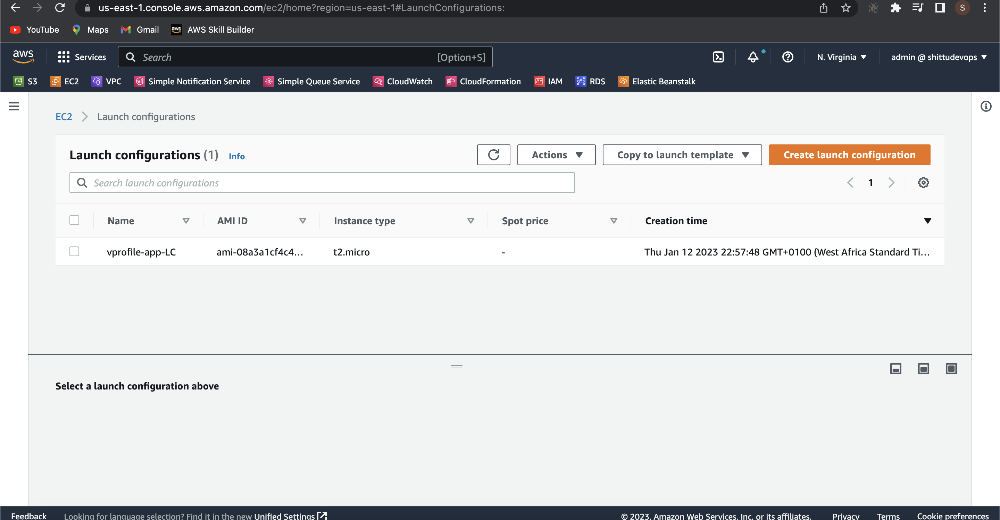
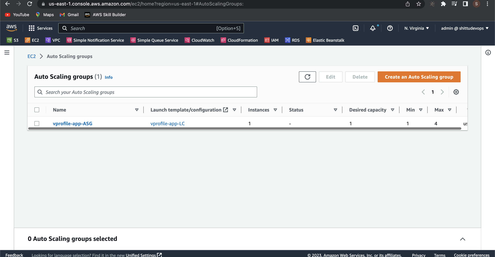

# AMAZON WEB SERVICE (AWS) CLOUD FOR WEB APPLICATION SETUP [LIFT AND SHIFT]
+ In this Project, We will be experiementing with a strategy called `LIFT AND SHIFT` for our web application setup. Lift And Shift is a strategy where application or a code base are being migrated from a local setup to the cloud environment in my case AWS. We will be migrating java based application just like the setup from [project 1](https://github.com/sadebare/AWS_DEVOPS_PROJECTS/tree/main/PROJECT_1)

##  AWS SERVICES USED
+ Elastic Compute Cloud (EC2)
+ Elastic Load Balancer (ELB)
+ Autoscaling
+ S3 bucket
+ Amazon Certtificate Manager (ACM)
+ Route 53
+ Security Group

##  OTHER TOOLS 
+ GoDaddy - For DNS resolution 
+ jdk8
+ maven

## STEP TAKEN FOR THE LIFTING AND SHIFTING APPLICATION ON AWS
### Step 1
  + Log in to your AWS account
  + Create a certificate on Amazon Certificate Manager and validate it up with the Domain we created on GoDaddy for a secure connection (HTTPS)

### Step 2
  + Navigate to the EC2 section from the console page and create a security group for our load balancer where we allow the inbound rules for http (port 80) and https (port 443) on any IPV4 and IPV6
  + Create a security for our TOMCAT instances and allow inbound rule on port 8080 from load balancer security group
  + We finally create security group for our backend services (rabbitMQ, Memcached and MySQL) and add inbound rule for MySQL (port 3306), memcached (port 11211), RabbitMQ (port 5672) and allow from only tomcat security group, also allow all traffic from its security group after we create the afore-mentioned rules, we then edit it with it
  + We edit all the security group created to allow an inbound rule of 22 for SSH permission

### Step 3
  + Create a key pair to login to all our EC2 instances.
  + Launch an instance for MySQL instances on Centos 7 using the bash script in [mysql.sh](./userdata/mysql.sh) as the userdata while provisioning the instance. Select the key created earlier and also in the network settings select an existing security group from the one we created for the backend services.
  + Also, launch a Centos 7 EC2 instance where we will be using the [memcache userdata](./userdata/memcache.sh) in provisioning, the same key pair used earlier and also same security group used.
  + We go through the same process for RabbitMQ using [bash script](./userdata/rabbitmq.sh)
  + Verify if the provisioned instances are up and running on the EC2 Console
    

### Step 4
  + We will update each of the private IP of the instances created in the private Route 53
  + Navigate to Route 53 and click on `Create hosted zone`
  + We can then create record for each of the backend services by placing their private IP and name in the record which will be used on our Tomct service
  

### Step 5
  + Launch an ubuntu 18 instance for the Tomcat server where we will be hosting our java based artifact using the [tomcat_ubuntu.sh](./userdata/tomcat_ubuntu.sh) in the userdata section, with the same login key and security group we created for the app
    

### Step 6
  + Let us update the application properties to our CNAME configured on Route53 in my case db01.vprofile.in, rmq01.vprofile.in and mc01.vprofile.in in the file src/main/resources/application.properties file
  + Now we can build our artifact by running the command 

        mvn install
  + After a successful build we can then see a target directory in our current directory where we have our `.war` file

### Step 7
  + Create an IAM user for authentication on aws cli and attach s3 full access policy to the user
  + Also, create a bucket using the aws cli, in my case 

        aws s3 mb s3://vprofile-artifact-storage1234
  + We upload our built artifact through aws command line tool to the s3 buckket from the target directory

        aws s3 cp vprofile-v2.war s3://vprofile-artifact-storage1234/vprofile-v2.war
  + In order to upload our artifact from s3 to tomcat server, we create a role for our EC2 and attach s3fullaccess permission, then attach the IAM role in the app EC2 instance
  + Login to the app server where we installed tomcat using SSH and then change to root user

        sudo -i
  + verify if tomcat8 is running by running the command 

        systemctl status tomcat8
  + Change the directory to /var/lib/tomcat8/webapps

        cd /var/lib/tomcat8/webapps
  + We then rmove the root directory which have the default application

        rm -rf ROOT/
  + Install awscli on the instance

         apt install awscli -y
  
  + Verify the s3 bucket from the cli

        aws s3 ls vprofile-artifact-storage1234
  + Download the artifact on the instance at the /tmp/ directory

        aws s3 cp s3://vprofile-artifact-storage1234/vprofile-v2.war /tmp/vprofile-v2.war
  + Verify the artifact by changing directory to /tmp/

        cd /tmp/
  + Copy the artifact to /var/lib/tomcat8/webapps/ROOT.war to become the default application

        cp vprofile-v2.war /var/lib/tomcat8/webapps/ROOT.war
  + We then restart tomcat8 service

        systemctl start tomcat8
### Step 8
  + Set up load balancer by creating a target group first for the app instance, then we create the application load balancer, after which we copy the url to the domain we bougt, then we verify the application by typing the `http://vprofileapp.barrydevops.com`

    
    
    
    
    

### Step 9
  + Set up autoscaling group for tomcat EC2 instance by creating an AMI of the instance which acts as a blue print of the instance
  + We can then launch configuration for the autoscaling group based on the AMI created 

      
  + Proceed to creating EC2 autoscaling group

      
  + Validate all and delete all the instances running to save cost

