# REFACTORING WITH AMAZON WEB SERVICE (AWS)
Using this strategy, you move an application to the cloud and modify its architecture by taking full advantage of cloud-native features to improve agility, performance, scalability and business continuity.

##  AWS SERVICES USED
+ AWS Beanstalk
+ Amazon Simple Storage Service (S3)
+ Amazon Relational Database System (RDS)
+ Amazon Elastic Cache
+ Amazon MQ
+ Amazon Route53
+ Amazon CloudFront
+ Amazon Cloudwatch

##  OTHER TOOLS 
+ GoDaddy - For DNS resolution 
+ jdk8
+ maven

##  SYSTEM ARCHITECTURE
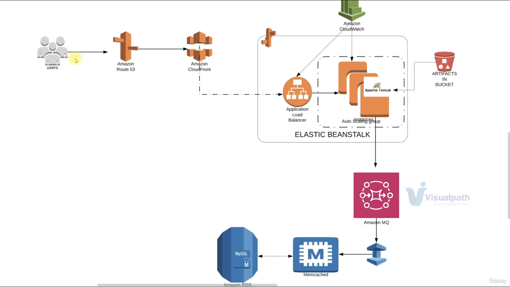

## STEP TAKEN FOR THE REFACTORING OF APPLICATION WITH AMAZON WEB SERVICE (AWS)
### Step 1
  + Log in to your AWS account
  + Create a login pair for our key pair EC2 instances in Beanstalk
  + Create security froup for our backend services on port 22, and also by itself
### Step 2
  + Create backend services, let us go with RDS first for he database. We create a subnet group for our DB instances, then a parameter groups for configuration of RDS service where we will be using Mysql5.7
  + Now, we can create our database on RDS and inject all our settings into it by choosing Amazon MySQL as the engine option. Don't forget to save the credentials for future usage.
  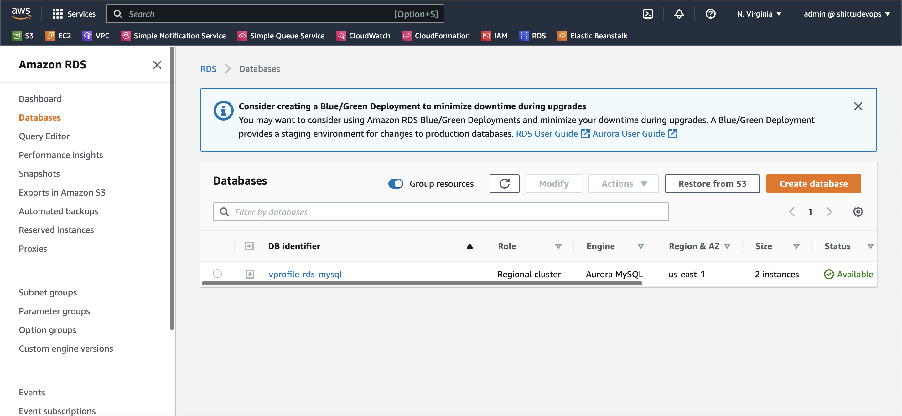
### Step 3
  + We then create our ElastiCache service for our in memory caching which its setup is more similar to RDS setup by creating its subnet groups and parameter groups. Also here you attach your backend security group
  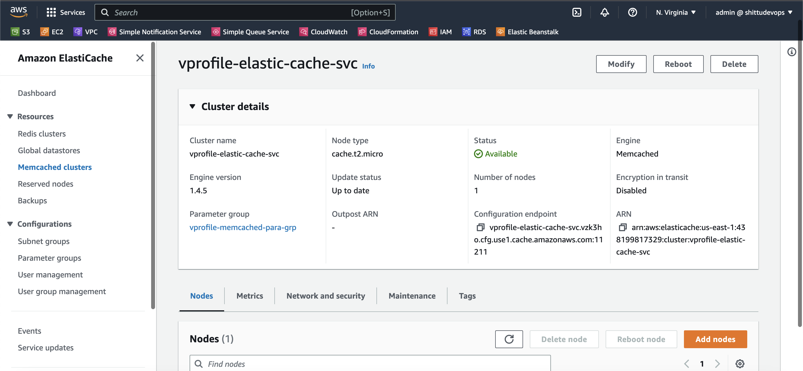
  + Proceed by creating Amazon MQ service and create the service just as we did for the ElastiCache
  +  Launch an EC2 instance for the database, so we can login and initialize our database which we will still delete the instance.
  + Run the folllowing script after being launched and ssh into it

        sudo apt update
        sudo apt install mysql-client -y
 +  Modify the security group for our backend service to allow port 3306  from mysql security group
 +  Then we can connect to our rds service using its endpoind, username and password gotten while creating rds instance, in my case

      mysql -h vprofile-rds-mysql.cluster-cgewbecqwona.us-east-1.rds.amazonaws.com -u admin -pUCVzS4PUetBfFBkMNmEt
  + After loggin in, we can show the databases to verify the account databse

        mysql> show databases;
  + Then, clone the source code unto the instance and move into the directory

        git clone https://github.com/sadebare/vprofile-project.git
        cd vprofile-project
        git checkout aws-Refactor
        cd src/main/resources

  +  Let's initialize the database with the schema provided in the resource 

        mysql -h vprofile-rds-mysql.cluster-cgewbecqwona.us-east-1.rds.amazonaws.com -u admin -pUCVzS4PUetBfFBkMNmEt accounts < db_backup.sql 
  + Let us login and make a test to show tables in accounts database

        mysql> use accounts;
        mysql> show tables;

### Step 4
  + Also note the endpoint for rabbitmq service and Elasticache service with their respective port number to be used in our src configuration code
  + Navigate to Elastic Beanstalk where we are to launch our application with minimal effort which will be giving us instances and load balancer, We select Tomcat as our platform and also backend security group and also choose your desired configuration
  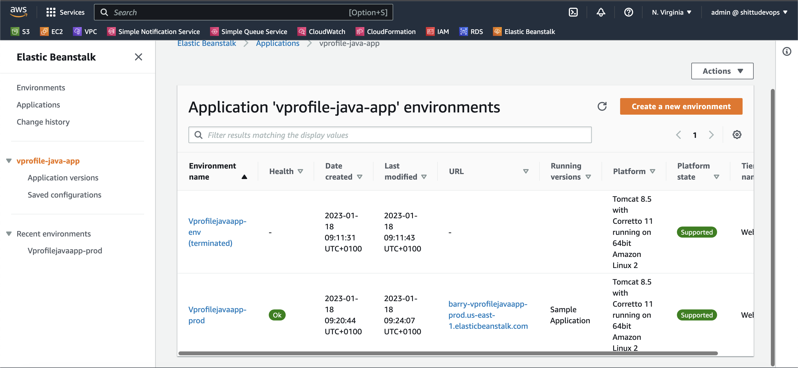
  
  + Now we can deploy our application in it, before that we make changes to our backend sg group to allow access from the beanstalk security group by allowing port 3306, 11211 and 5671 for it to connect to beanstalk
  + Modify the load balancer at the beanstalk interface to allow port 443 and also endpoint at `/login`

### Step 5
  + Now, we can run build our artifact to be deployed locally
  + But before that, we make changes to the application property in the src/main/resources/ directory and fill in the rds endpoints, rds username, rds password, memcached endpoint, rabbitmq endpoint, rabbitmq password
  + We then build our application into an artifact

        mvn install
  + Now we can upload the artifact on our beanstalk environment using the console and deploy 
  + After successful deployment, we can then verify using the endpoint from beanstalk service.
  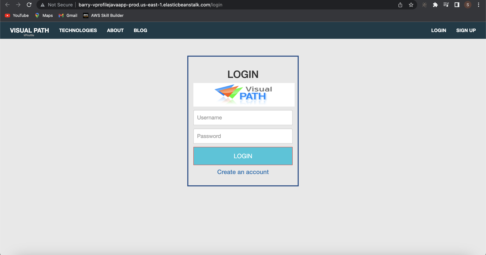
  + We can then link the beanstalk endpoint to a CNAME in Godaddy
  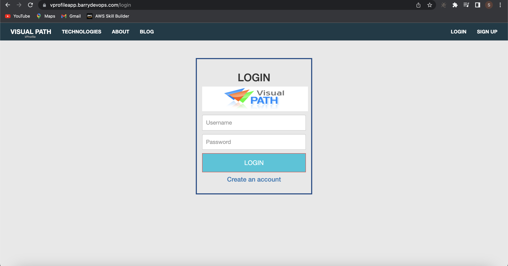
  + We can validate our rds by loggin in
  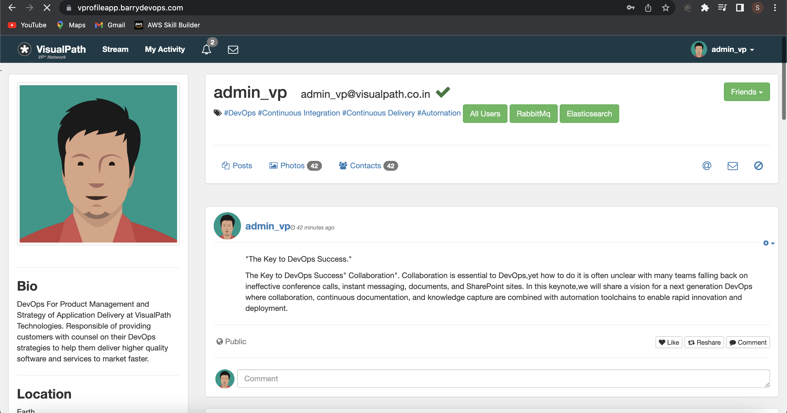
  + Also, validate Active mq service
  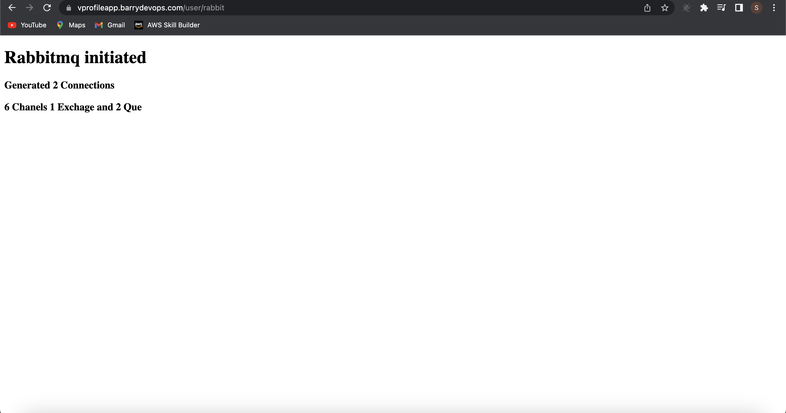
  + Now, elastic cache
    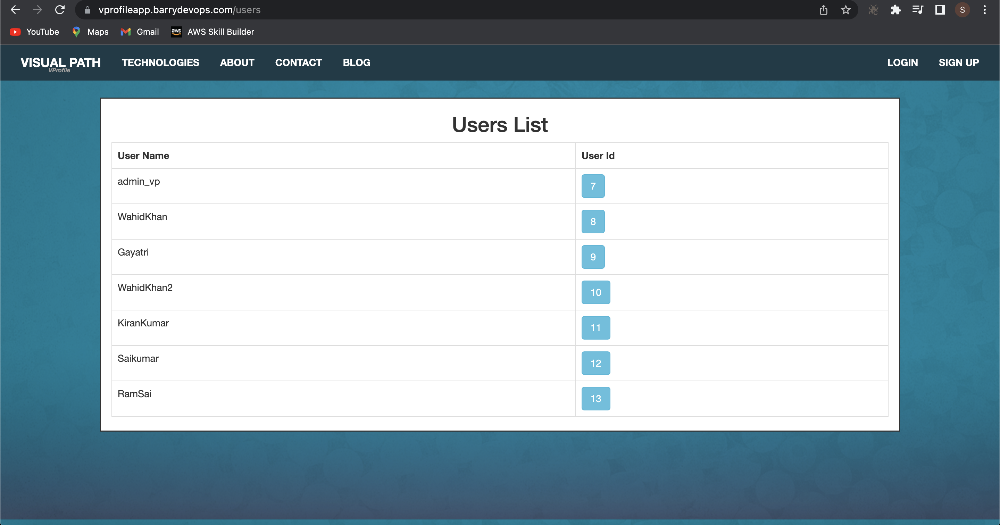
    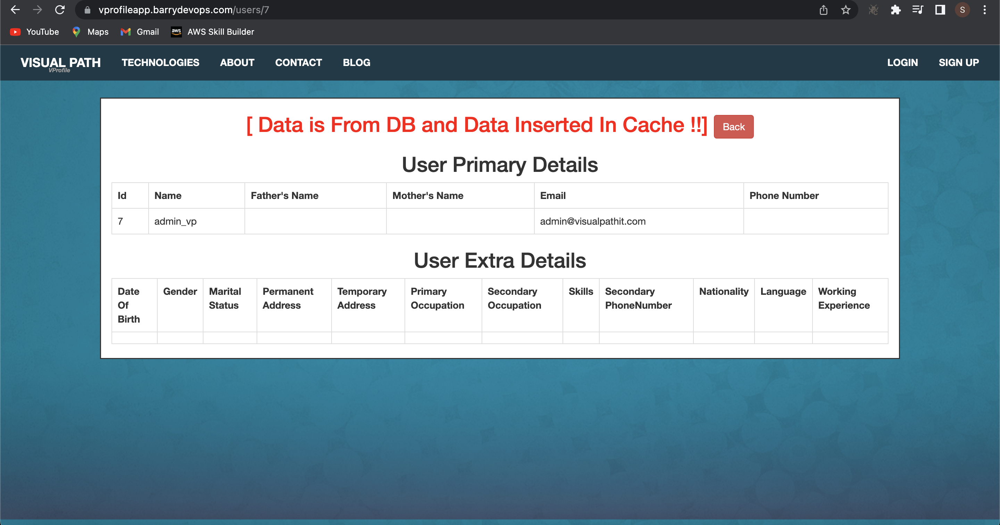
    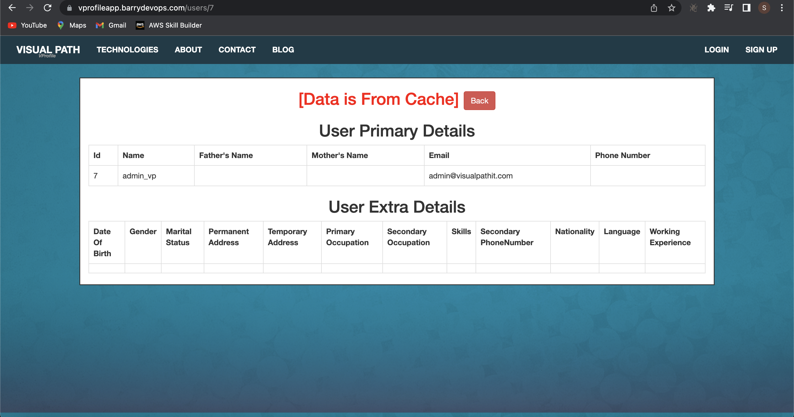
### Step 6
  + Let's attach Cloudfront to our beanstalk for fast content delivery to the user around the world by using Amazon CloudFront
  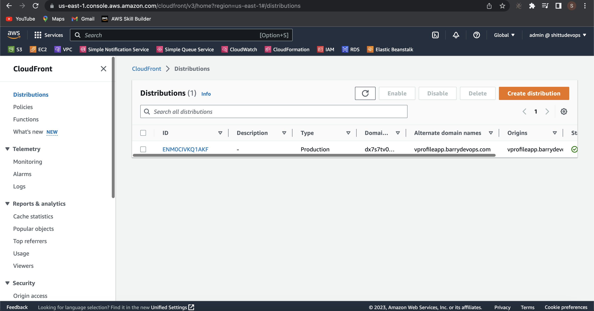
  + Lastly, we terminate all our service to eliminate uneccessary cost.