#   CONTINUOUS INTEGRATION USING JENKINS, NEXUS, SONARQUBE AND SLACK

##   System Design

##   Prerequisite 
+   AWS account log in
+   SonarQube
+   Nexus
+   Maven
+   Jenkins
+   Slack

##  Continuous integration Flow
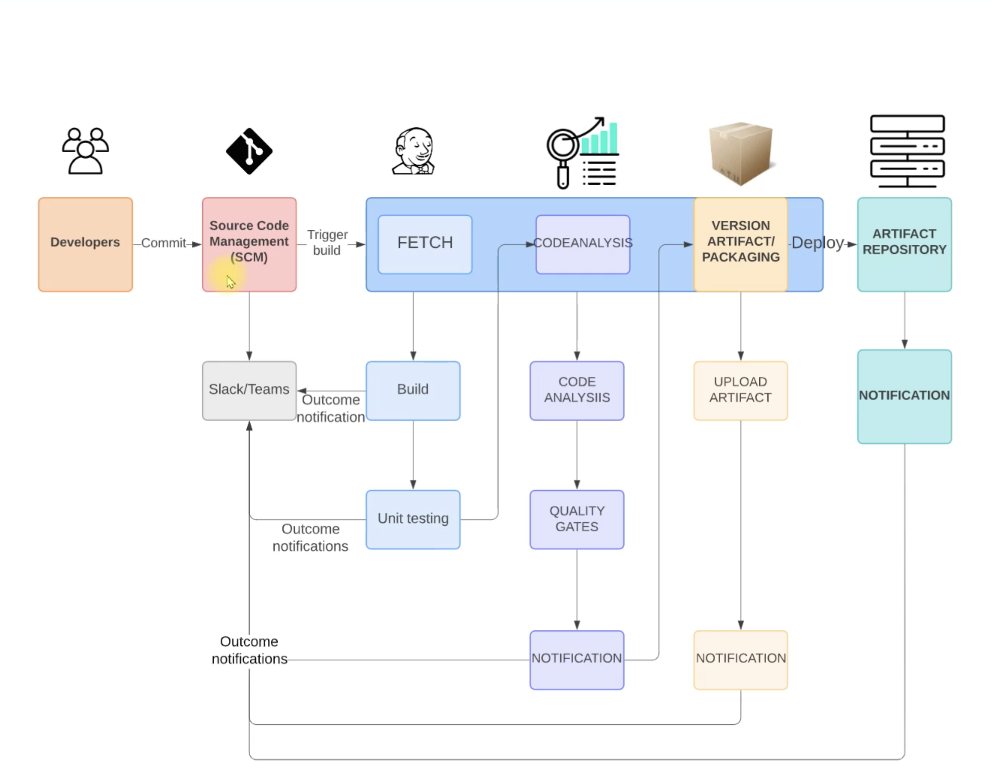
##   Step 1: Create a key pair for our instances
  + In this step we will set up a key for all our three instances (SonarQube, Nexus and Jenkins) with `.pem `format
  + Downloading this key will give us access to the instances, since we are planning of using ssh to log into the servers

##  Step 2: Create security group for our three instances
  + For jenkins - we will be using inbound rule on port 22 to allow ssh login and port 8080 to allow jenkins. we will be adding some rules later
  + For Nexus - Also eding inbound rule to allow traffic from port 22 -ssh, port 8081 to access it from the browser and also port 8081 from the jenkins security group.
  + For SonarQube - Here also, we will be allowing inbound rule at port 22 -ssh, port 80, also port 80 allow from jenkins security group
  + Now we can edit jenkins inbound rule to allow traffic from sonarqube security group

##  Step 3: Launch EC2 instance
  + Here we will be launching three EC2 instances (jenkins, nexus and sorqube)
  + Jenkins instance - launch an ubuntu instance of `AMI 20.04 LTS` with instance type of `t2.small`, select the previously created key pair from step 1. Also we select security group for jenkins created in step 2. Paste the script in the userdata section of the instance and then launch it

        #!/bin/bash
        sudo apt update
        sudo apt install openjdk-11-jdk -y
        sudo apt install maven -y
        curl -fsSL https://pkg.jenkins.io/debian-stable/jenkins.io.key | sudo tee \
          /usr/share/keyrings/jenkins-keyring.asc > /dev/null
        echo deb [signed-by=/usr/share/keyrings/jenkins-keyring.asc] \
          https://pkg.jenkins.io/debian-stable binary/ | sudo tee \
          /etc/apt/sources.list.d/jenkins.list > /dev/null
        sudo apt-get update
        sudo apt-get install jenkins -y
        ###

  + Nexus instance - launch an Amazon linux 2 AMI with instance type of `t2.medium` with thesame key pair and security group for nexus created earlier and paste the script below in the userdata section and we launch the instance.

        #!/bin/bash
        yum install java-1.8.0-openjdk.x86_64 wget -y   
        mkdir -p /opt/nexus/   
        mkdir -p /tmp/nexus/                           
        cd /tmp/nexus/
        NEXUSURL="https://download.sonatype.com/nexus/3/latest-unix.tar.gz"
        wget $NEXUSURL -O nexus.tar.gz
        EXTOUT=`tar xzvf nexus.tar.gz`
        NEXUSDIR=`echo $EXTOUT | cut -d '/' -f1`
        rm -rf /tmp/nexus/nexus.tar.gz
        rsync -avzh /tmp/nexus/ /opt/nexus/
        useradd nexus
        chown -R nexus.nexus /opt/nexus 
        cat <<EOT>> /etc/systemd/system/nexus.service
        [Unit]                                                                          
        Description=nexus service                                                       
        After=network.target                                                            
                                                                          
        [Service]                                                                       
        Type=forking                                                                    
        LimitNOFILE=65536                                                               
        ExecStart=/opt/nexus/$NEXUSDIR/bin/nexus start                                  
        ExecStop=/opt/nexus/$NEXUSDIR/bin/nexus stop                                    
        User=nexus                                                                      
        Restart=on-abort                                                                
                                                                          
        [Install]                                                                       
        WantedBy=multi-user.target                                                      
        EOT
        echo 'run_as_user="nexus"' > /opt/nexus/$NEXUSDIR/bin/nexus.rc
        systemctl daemon-reload
        systemctl start nexus
        systemctl enable nexus

  + Sonar instance - we launch an ubuntu 18 instance, instance type of `t2.medium`, using thesame key pair created earlier and security group of sonar created earlier. Paste the below script in the user data section to launch the instance.

        #!/bin/bash
        cp /etc/sysctl.conf /root/sysctl.conf_backup
        cat <<EOT> /etc/sysctl.conf
        vm.max_map_count=262144
        fs.file-max=65536
        ulimit -n 65536
        ulimit -u 4096
        EOT
        cp /etc/security/limits.conf /root/sec_limit.conf_backup
        cat <<EOT> /etc/security/limits.conf
        sonarqube   -   nofile   65536
        sonarqube   -   nproc    409
        EOT
        sudo apt-get update -y
        sudo apt-get install openjdk-11-jdk -y
        sudo update-alternatives --config java
        java -version
        sudo apt update
        wget -q https://www.postgresql.org/media/keys/ACCC4CF8.asc -O - | sudo apt-key add -
        sudo sh -c 'echo "deb http://apt.postgresql.org/pub/repos/apt/ `lsb_release -cs`-pgdg main" >> /etc/apt/sources.list.d/pgdg.list'
        sudo apt install postgresql postgresql-contrib -y
        #sudo -u postgres psql -c "SELECT version();"
        sudo systemctl enable postgresql.service
        sudo systemctl start  postgresql.service
        sudo echo "postgres:admin123" | chpasswd
        runuser -l postgres -c "createuser sonar"
        sudo -i -u postgres psql -c "ALTER USER sonar WITH ENCRYPTED PASSWORD 'admin123';"
        sudo -i -u postgres psql -c "CREATE DATABASE sonarqube OWNER sonar;"
        sudo -i -u postgres psql -c "GRANT ALL PRIVILEGES ON DATABASE sonarqube to sonar;"
        systemctl restart  postgresql
        #systemctl status -l   postgresql
        netstat -tulpena | grep postgres
        sudo mkdir -p /sonarqube/
        cd /sonarqube/
        sudo curl -O https://binaries.sonarsource.com/Distribution/sonarqube/sonarqube-8.3.0.34182.zip
        sudo apt-get install zip -y
        sudo unzip -o sonarqube-8.3.0.34182.zip -d /opt/
        sudo mv /opt/sonarqube-8.3.0.34182/ /opt/sonarqube
        sudo groupadd sonar
        sudo useradd -c "SonarQube - User" -d /opt/sonarqube/ -g sonar sonar
        sudo chown sonar:sonar /opt/sonarqube/ -R
        cp /opt/sonarqube/conf/sonar.properties /root/sonar.properties_backup
        cat <<EOT> /opt/sonarqube/conf/sonar.properties
        sonar.jdbc.username=sonar
        sonar.jdbc.password=admin123
        sonar.jdbc.url=jdbc:postgresql://localhost/sonarqube
        sonar.web.host=0.0.0.0
        sonar.web.port=9000
        sonar.web.javaAdditionalOpts=-server
        sonar.search.javaOpts=-Xmx512m -Xms512m -XX:+HeapDumpOnOutOfMemoryError
        sonar.log.level=INFO
        sonar.path.logs=logs
        EOT
        cat <<EOT> /etc/systemd/system/sonarqube.service
        [Unit]
        Description=SonarQube service
        After=syslog.target network.target
        [Service]
        Type=forking
        ExecStart=/opt/sonarqube/bin/linux-x86-64/sonar.sh start
        ExecStop=/opt/sonarqube/bin/linux-x86-64/sonar.sh stop
        User=sonar
        Group=sonar
        Restart=always
        LimitNOFILE=65536
        LimitNPROC=4096
        [Install]
        WantedBy=multi-user.target
        EOT
        systemctl daemon-reload
        systemctl enable sonarqube.service
        #systemctl start sonarqube.service
        #systemctl status -l sonarqube.service
        apt-get install nginx -y
        rm -rf /etc/nginx/sites-enabled/default
        rm -rf /etc/nginx/sites-available/default
        cat <<EOT> /etc/nginx/sites-available/sonarqube
        server{
            listen      80;
            server_name sonarqube.groophy.in;
            access_log  /var/log/nginx/sonar.access.log;
            error_log   /var/log/nginx/sonar.error.log;
            proxy_buffers 16 64k;
            proxy_buffer_size 128k;
            location / {
                proxy_pass  http://127.0.0.1:9000;
                proxy_next_upstream error timeout invalid_header http_500 http_502 http_503 http_504;
                proxy_redirect off;
                      
                proxy_set_header    Host            \$host;
                proxy_set_header    X-Real-IP       \$remote_addr;
                proxy_set_header    X-Forwarded-For \$proxy_add_x_forwarded_for;
                proxy_set_header    X-Forwarded-Proto http;
            }
        }
        EOT
        ln -s /etc/nginx/sites-available/sonarqube /etc/nginx/sites-enabled/sonarqube
        systemctl enable nginx.service
        #systemctl restart nginx.service
        sudo ufw allow 80,9000,9001/tcp
        echo "System reboot in 30 sec"
        sleep 30
        reboot

# Step 4: Post installation
  + Jenkins instance - ssh into the jenkins instance created using the key pair generated. Change to root directory `sudo -i`
      + check if the jenkins process is running

            systemctl status jenkins
      +   We can then access the jenkins from the browsing by grabbing it public address 

              <public-address>:8080
      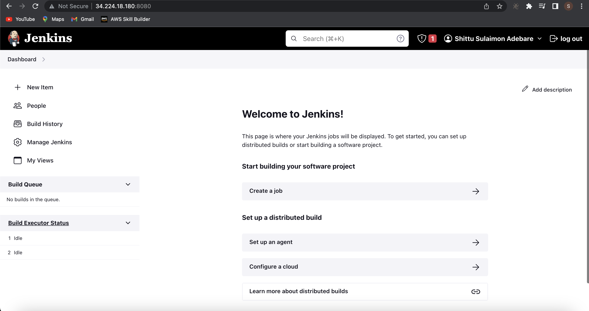
      + From the jenkins instance running, we get the password to log into the instance

              cat /var/lib/jenkins/secrets/initialAdminPassword
      + After authenticating with password, we install suggested plugins and fill our datas. Please remember your username and password.
      + we need to install some plugins in jenkins from the user interface, we navigate to manage jenkins > manage plugins and install some plugins such as 

            Maven Integration
            Github Integration
            Nexus Artifact Uploader
            SonarQube Scanner
            Slack Notification
            Build Timestamp
  + Nexus server - ssh into the server using the key generated.
      + Run the following command to check if the nexus service is running

            systemctl status nexus
      + We can access the sonarqube instance from the browser by getting its public address on port 8081

            <public-ip>:8081
          
      + Get the password from the terminal using 

            cat /opt/nexud/sonatype-work/nexus3/admin.password
      + username - admin, password from the previous command
      + Disable anonymous access after authentication.
      + Navigate to repository and create a new one (maven2 - hosted and maven2 - proxy [remote storage - https://repo1.maven.org/maven2/])
      + one more repository with configuration

            maven2 - hosted 
            name :- vprofile-snapshot
            version policy: snap shot
      + Lastly create a repository with the configuration

            type: maven2 - group
            name: vpro-maven-group
            group: All three repository created earlier
  + Sonar instance: Grap the public ip address and paste it on the browser and login using username:- admin and password:- admin.
      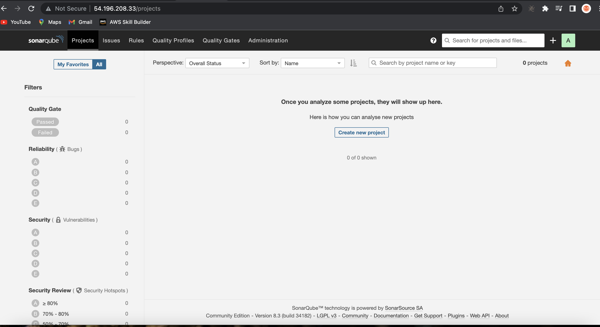
##  Step 5: Git Code Migration
  + We will be using a private repository for the exercise. we migrate code to private one. We will be using the repo

        git clone -b ci-jenkins https://github.com/sadebare/vprofile-project.git
##  Step 6: Build job with Nexus repo
  + We need some dependency to build our job on jenkins server which include:- maven and jdk8 to complete our build
  + Do that by navigating from our jenkins ui, manage jenkins > Global Tool Configuration
    + We need jdk8 installed, here we will be using path from the jenkins instance. ssh into the jenkins server and run the following command 

          sudo apt update
          sudo apt install openjdk-8-jdk -y
    
    + paste /usr/lib/jvm/java-1.8.0-openjdk-amd64 in the path section when installing jdk8
  + Also in the maven section select maven3 and save the configuration.
  + Let is save the nexus login credential to upload the artifact by navigating to Manage Credentials > system > Global credentials and here we can pass our login details 
  +  create a jenkins script with

          pipeline {
          agent any
          tools {
              maven "MAVEN3"
              jdk "OracleJDK8"
          }

          environment {
              SNAP_REPO = 'vprofile-snapshot'
              NEXUS_USER = 'admin'
              NEXUS_PASS = 'admin'
              RELEASE_REPO = 'vprofile-release'
              CENTRAL_REPO = 'vpro-maven-central'
              NEXUSIP = '172.31.29.120'
              NEXUSPORT = '8081'
              NEXUS_GRP_REPO = 'vpro-maven-group'
              NEXUS_LOGIN = 'nexuslogin'
          }

          stages {
              stage('Build') {
                  steps {
                      sh 'mvn -s settings.xml -DskipTests install'
                  }
              }
          }
      }
      
  + Now, we create a job on jenkins server with the below property

        Pipeline from SCM 
        Git
        URL: <url_from_project> I will use SSH link
        Crdentials: we will create github login credentials
        #### add Jenkins credentials for github ####
        Kind: SSH Username with private key
        ID: githublogin
        Description: githublogin
        Username: git
        Private key file: paste your private key here
        #####
        Branch: */ci-jenkins
        path: Jenkinsfile
  + Error is not gone, we need to login jenkins server via SSH and complete host-key checking step. After below command, our host-key will be stored in .ssh/known_hosts file.Then error will be gone.

        sudo -i
        sudo su - jenkins
        git ls-remote -h -- git@github.com:sadebare/vprociproject.git HEAD
  + Now its Build time. Our build pipeline is successful!
    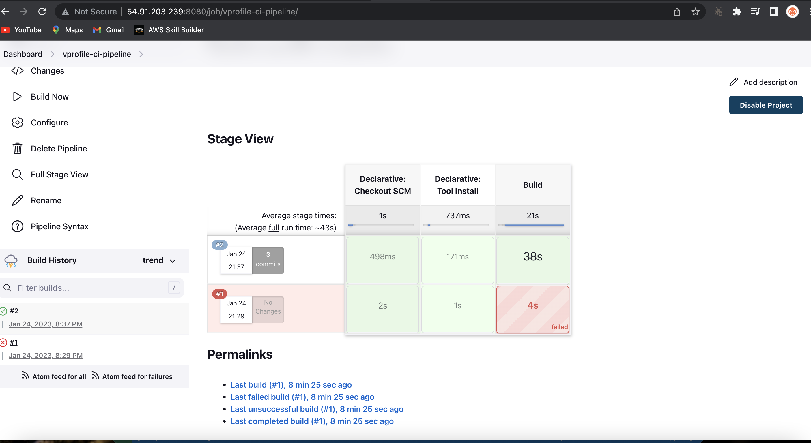
##  Step 7: Github Webhook
  + Here we automate the process of manual build from the jenkins using Github webhook whenever there is a commit to the VCS
  + Copy the jenkins url, navigate to the repo settings. Go to the webhooks and follow the process

        payload url: http://<public-ip>:8080/github-webhook/
        Content type: application/json
  + Go to the current jenkins job > configure. check mark `GitHub hook trigger for GITScm polling` then save.
  + paste the following script and push to your Github. 

        pipeline {
        agent any
        tools {
            maven "MAVEN3"
            jdk "OracleJDK8"
        }

        environment {
            SNAP_REPO = 'vprofile-snapshot'
            NEXUS_USER = 'admin'
            NEXUS_PASS = 'admin'
            RELEASE_REPO = 'vprofile-release'
            CENTRAL_REPO = 'vpro-maven-central'
            NEXUSIP = '172.31.29.120'
            NEXUSPORT = '8081'
            NEXUS_GRP_REPO = 'vpro-maven-group'
            NEXUS_LOGIN = 'nexuslogin'
        }

        stages {
            stage('Build') {
                steps {
                    sh 'mvn -s settings.xml -DskipTests install'
                }
                post {
                    success {
                        echo "Now Archiving."
                        archiveArtifacts artifacts: '**/*.war'
                    }
                }
            }

            stage('Test') {
                steps {
                    sh 'mvn test'
                }
            }

            stage('Checkstyle Analysis'){
                steps {
                    sh 'mvn -s settings.xml checkstyle:checkstyle'
                }
            }
        }
      }
  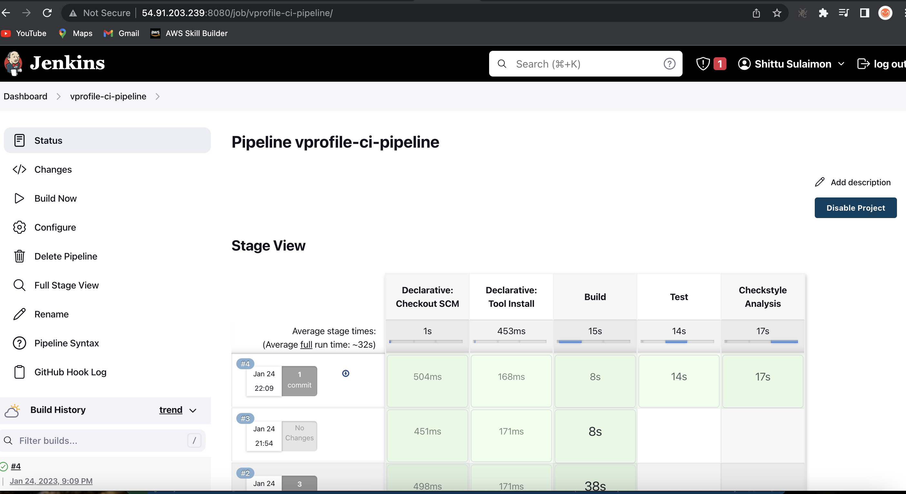

##  Step 8: Code Analysis with Sonarqube
  + On the jenkins ui, navigate to manage jenkins > Global Tool Configuration

        plugin: SonarQube scanner
        Name: sonarscanner

  + Store the sonarqube information by navigating to manage jenkins > Configure System

        plugin: SonarQube servers
        name: sonarserver
        server url: http://<private-ip-sonarserver>
  + Generate token from sonarqube ui to authenticate in jenkins

  + Go back to the Configure System and update with the info

        add jenkins credential
        kind: secret text
        secret: <paste secret from sonar>
  + Now, it is time to add another jenkins file to test the sonarqube integration

              pipeline {
          agent any
          tools {
              maven "MAVEN3"
              jdk "OracleJDK8"
          }

          environment {
              SNAP_REPO = 'vprofile-snapshot'
              NEXUS_USER = 'admin'
              NEXUS_PASS = 'admin'
              RELEASE_REPO = 'vprofile-release'
              CENTRAL_REPO = 'vpro-maven-central'
              NEXUSIP = '172.31.29.120'
              NEXUSPORT = '8081'
              NEXUS_GRP_REPO = 'vpro-maven-group'
              NEXUS_LOGIN = 'nexuslogin'
              SONARSERVER = 'sonarserver'
              SONARSCANNER = 'sonarscanner'
          }

          stages {
              stage('Build') {
                  steps {
                      sh 'mvn -s settings.xml -DskipTests install'
                  }
                  post {
                      success {
                          echo "Now Archiving."
                          archiveArtifacts artifacts: '**/*.war'
                      }
                  }
              }

              stage('Test') {
                  steps {
                      sh 'mvn test'
                  }
              }

              stage('Checkstyle Analysis'){
                  steps {
                      sh 'mvn -s settings.xml checkstyle:checkstyle'
                  }
              }
              stage('CODE ANALYSIS with SONARQUBE') {
                
                environment {
                  scannerHome = tool "${SONARSCANNER}"
                }

                steps {
                  withSonarQubeEnv("${SONARSERVER}") {
                    sh '''${scannerHome}/bin/sonar-scanner -Dsonar.projectKey=vprofile \
                        -Dsonar.projectName=vprofile-repo \
                        -Dsonar.projectVersion=1.0 \
                        -Dsonar.sources=src/ \
                        -Dsonar.java.binaries=target/test-classes/com/visualpathit/account/controllerTest/ \
                        -Dsonar.junit.reportsPath=target/surefire-reports/ \
                        -Dsonar.jacoco.reportsPath=target/jacoco.exec \
                        -Dsonar.java.checkstyle.reportPaths=target/checkstyle-result.xml'''
                  }

                }
              }
          }
      }
  
  + Check the dash board as you commit, it builds automatically
      
      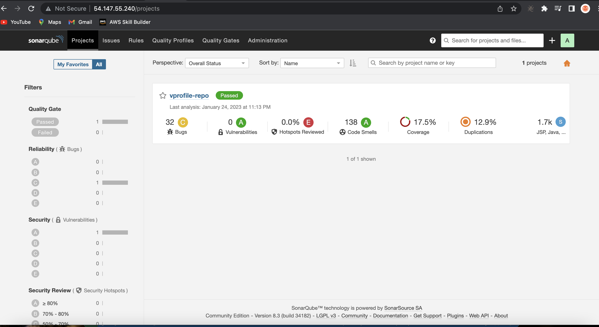
##  Step 9: Sonar Quality Gate
  + Create our customized quality gate

        Add condition: On overall code
  + Then add a webhook to connect to our jenkins server
  + Time to update our Jenkinsfile and push for automatic build

         stage('QUALITY GATE') {
            steps {
                timeout(time: 10, unit: 'MINUTES') {
               waitForQualityGate abortPipeline: true
            }
            }
          }
    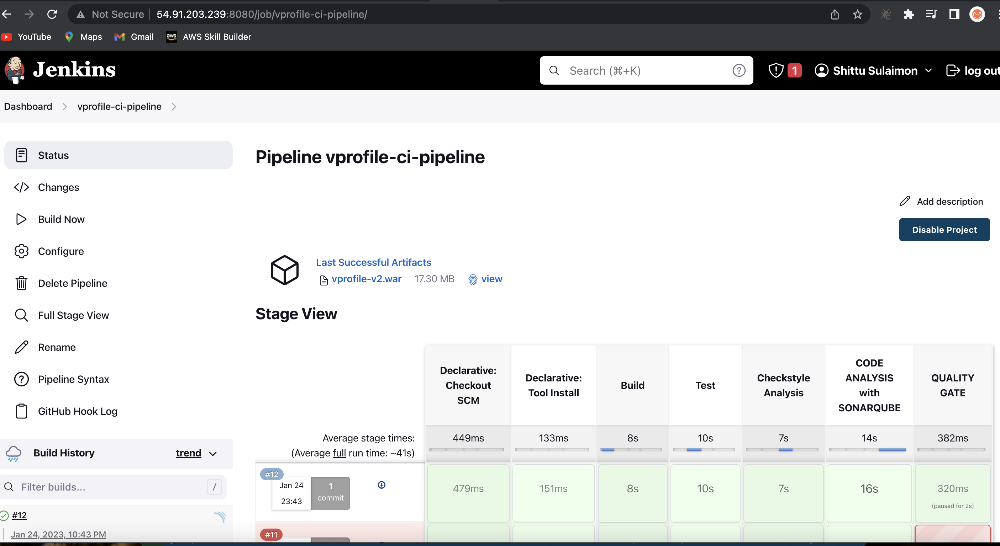
##  Step 10: Publish Artifact To Nexus Repo
  + In this step, we will automate process of publishing latest artifact to Nexus repository after successful build. We need to add Build-Timestamp to artifact name to get unique artifact each time. We can go to Manage Jenkins -> Configure System under Build Timestamp we can update the pattern as our wish.

        yy-MM-dd_HHmm
  + We will add below stage to our pipeline and see results.

        stage('UPLOAD ARTIFACT') {
                steps {
                    nexusArtifactUploader(
                        nexusVersion: 'nexus3',
                        protocol: 'http',
                        nexusUrl: "${NEXUSIP}:${NEXUSPORT}",
                        groupId: 'QA',
                        version: "${env.BUILD_ID}-${env.BUILD_TIMESTAMP}",
                        repository: "${RELEASE_REPO}",
                        credentialsId: "${NEXUS_LOGIN}",
                        artifacts: [
                            [artifactId: 'vproapp' ,
                            classifier: '',
                            file: 'target/vprofile-v2.war',
                            type: 'war']
                        ]
                    )
                }
        }
    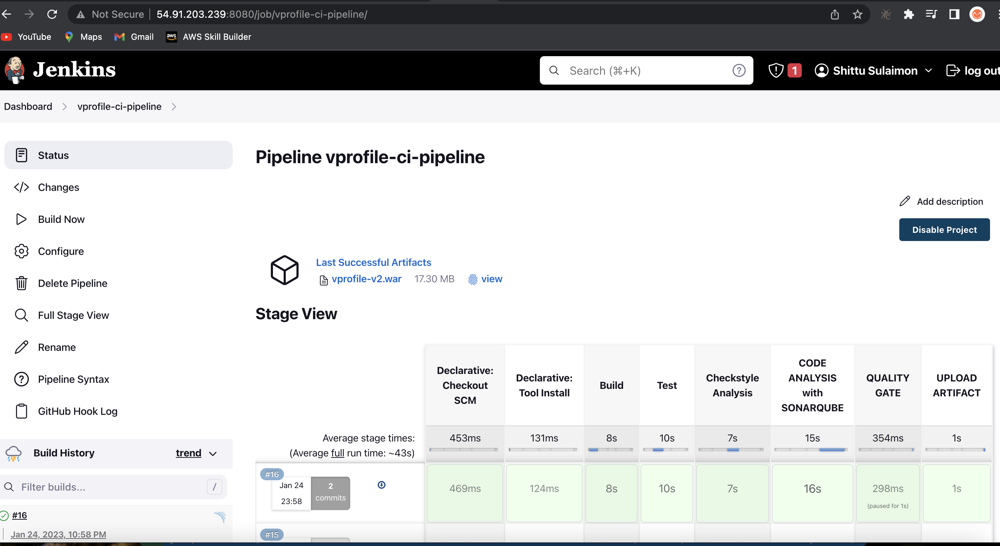
    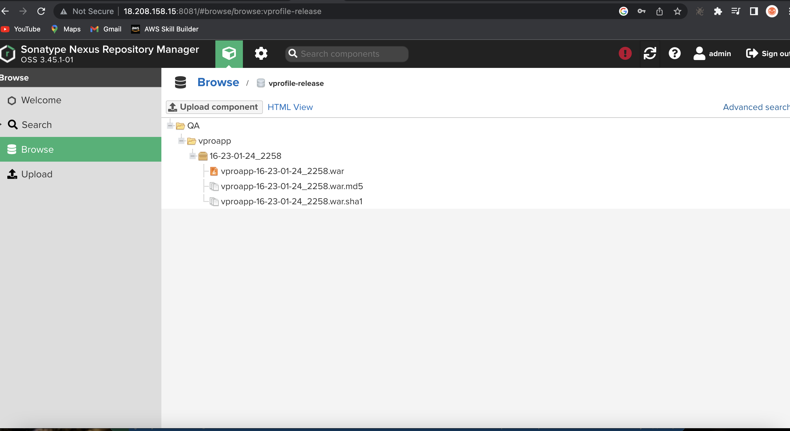
##  Step 11: Slack Notification
  + We will Login to slack and create a workspace by following the prompts. Then we will create a channel jenkins-cicd in our workspace.
  + Next we need to Add jenkins app to slack. Search in Google with Slack apps. Then search for jenkins add to Slack. We will choose the channel jenkins-cicd. It will give us to setup instructions, from there copy Integration token credential ID 
    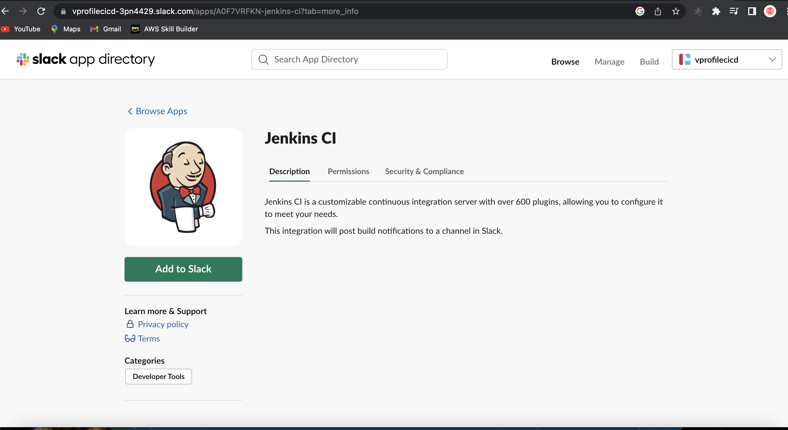
  + We will go to Jenkins dashboard Configure system -> Slack

        Workspace:  example (in the workspace url example.slack.com)
        credential: slacktoken 
        default channel: #jenkins-cicd
  + We will add our sonar token to global credentials.

        Kind: secret text
        Secret: <paste_token>
        name: slacktoken
        description: slacktoken
  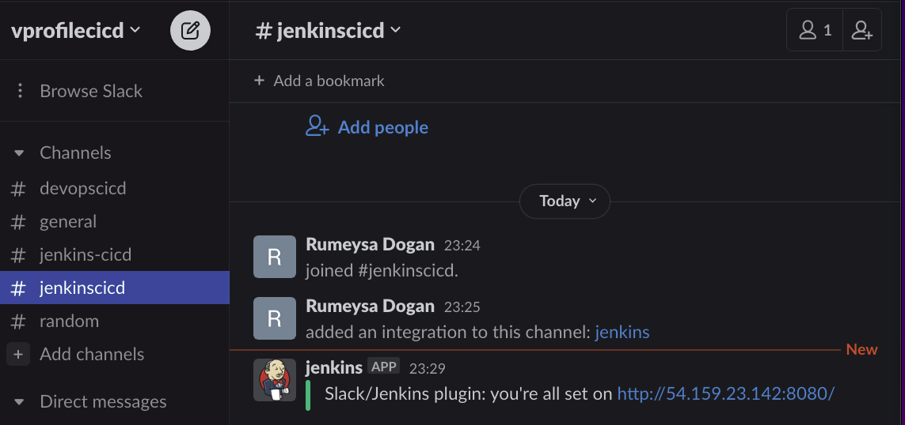

  + We will add below part to our Jenkinsfile in the same level with stages and push our changes.

        post{
          always {
              echo 'Slack Notifications'
              slackSend channel: '#jenkinscicd',
                  color: COLOR_MAP[currentBuild.currentResult],
                  message: "*${currentBuild.currentResult}:* Job ${env.JOB_NAME} build ${env.BUILD_NUMBER} \n More info at: ${env.BUILD_URL}"
          }
      }
  + Voila! We get our Notification from slack.
    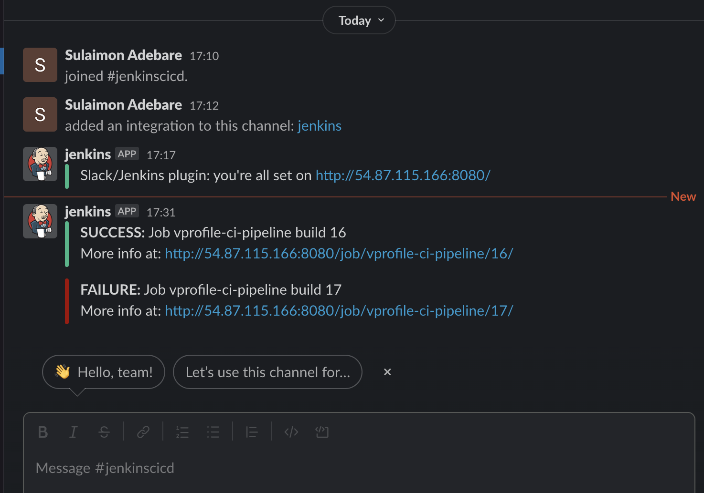

[Project source](https://www.udemy.com/course/devopsprojects/)