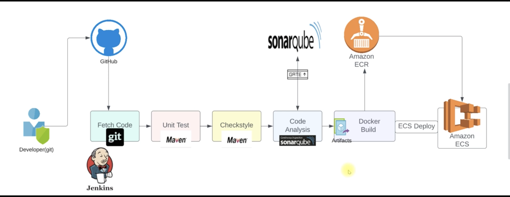
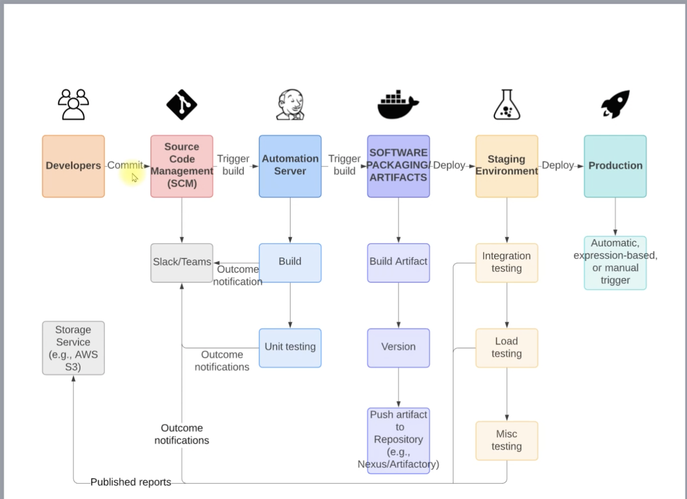
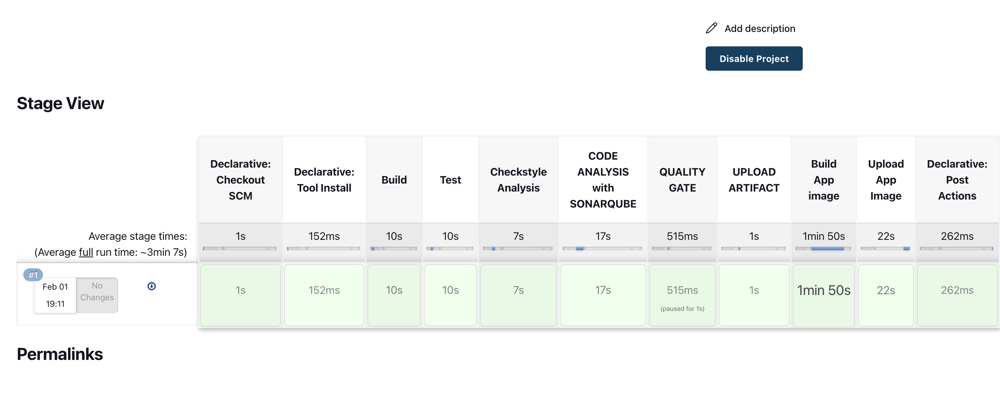
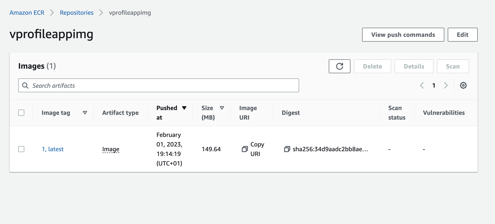
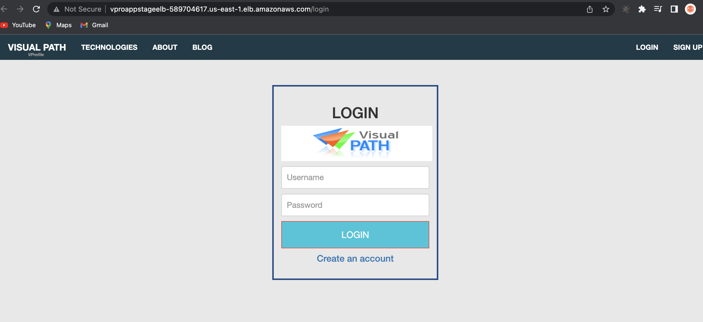
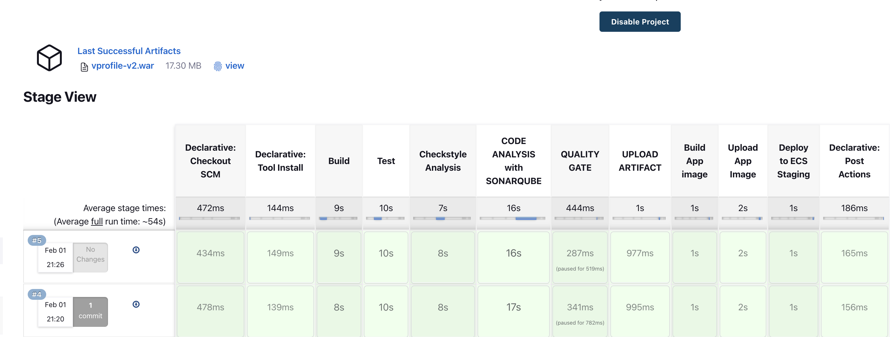
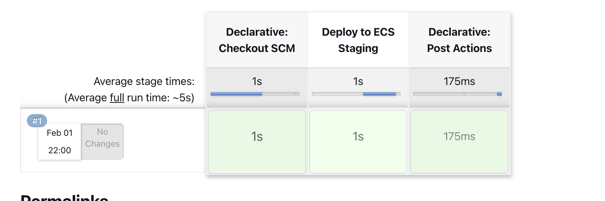
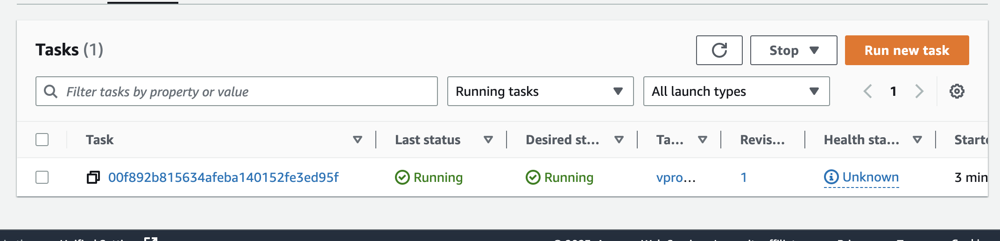

# CONTINUOUS DELIVERY WITH JENKINS AND TOOLS

##  Prerequisite
  + Jenkins
  + Nexus Sonartype Repository
  + Sonarqube
  + Maven
  + Git
  + Slack
  + Docker
  + Amazon Elastic Container Registry (ECR)
  + Amazon Elastic Container Service (ECS)
  + AWS CLI

##  Steps taken to achieve the process

##  Step 1: Creating Branches And WebHook On Github
  + This is a continuation of the continuous integration project in [Project-5](https://github.com/sadebare/AWS_DEVOPS_PROJECTS/tree/main/PROJECT_5). So, we are expected to have our jenkins, sonar and nexus server running
  + If the server was turned off, we need to get the jenkins public IP and update at the Gitthub webhook level for build trigger.
  + Navigate to the [project_directory](https://github.com/sadebare/vprofile-project) and switch to the `docker` branch. Then download the zip file of the repository where we can extract it on our local system.
  + Following up with the directory created from [Project-5](https://github.com/sadebare/AWS_DEVOPS_PROJECTS/tree/main/PROJECT_5), go to the privately created directory and follow along

        git checkout ci-jenkins
        git checkout -b cicd-jenkins
  + Copy the dockerfile from the cloned directory of the zipped file into our directoy
  + Create two folder in our working directory and not the zipped file.

        mkdir StagePipeline ProdPipeline
        cp Jenkinsfile StagePipeline 
        cp Jenkinsfile ProdPipeline 
        cat .git/config
        git add . && git commit -m "dockerfile and prodpipeline added" && git push origin cicd-jenkins

  + We created StagePipeline for use in the staging level and ProdPipeline to be used at production level and also we have 3 braches on our repository

##  Step 2: AWS IAM and ECR
  + Create a IAM User for the jenkins serer to access the ECR and ECS and download the secret and access key

        User: cicdjenkins
        policies: AmazonEC2ContainerRegistryFullAccess, AmazonECS_FullAccess
  + On the ECR page we have the following configuration

      visibility: private
      Repository name: vprofileappimg

##  Step 3: Jenkins Configuration
  + Install the neccessary plugins manage jenkins >= manage plugins 

        plugins:  Docker Pipeline, CloudBees Docker Build and Publish, Amazon ECR, Pipeline: AWS Steps, CloudBees AWS Credentials
  + Now we can store aws access key and secret key in our jenkins manage jenkins >= manage credentials 

        Kind: aws credential
        ID: awscreds
        accesskey ID: <from-the-downloaded-file>
        Secret Access Key: <from-the-downloaded-file>
  + Do an SSH to the jenkins serer to install awscli and docker engine

        sudo -i
        apt update && apt install awscli -y
        sudo apt-get install \
        ca-certificates \
        curl \
        gnupg \
        lsb-release
        sudo mkdir -p /etc/apt/keyrings
        curl -fsSL https://download.docker.com/linux/ubuntu/gpg | sudo gpg --dearmor -o /etc/apt/keyrings/docker.gpg
        echo \
        "deb [arch=$(dpkg --print-architecture) signed-by=/etc/apt/keyrings/docker.gpg] https://download.docker.com/linux/ubuntu \
        $(lsb_release -cs) stable" | sudo tee /etc/apt/sources.list.d/docker.list > /dev/null
        sudo apt-get update
        sudo apt-get install docker-ce docker-ce-cli containerd.io docker-compose-plugin -y
        usermod -aG docker jenkins

##  Step 3: Docker build in pipeline
  + We will add below env variables and stages to the Jenkinsfile under StagePipeline directory.

        #### 3 new environment variables ####
         registryCredential = 'ecr:us-east-1:awscreds'
        appRegistry = '392530415763.dkr.ecr.us-east-1.amazonaws.com/vprofileappimg'
        vprofileRegistry = "https://392530415763.dkr.ecr.us-east-1.amazonaws.com"
        ################################
            stage('Build App image'){
                    steps{
                        script{
                          dockerImage = docker.build( appRegistry + ":$BUILD_NUMBER", "./Docker-files/app/multistage/")
                        }
                    }
                }

                stage('Upload App Image'){
                    steps{
                        script{
                            docker.withRegistry( vprofileRegistry, registryCredential ) {
                                dockerImage.push("$BUILD_NUMBER")
                                dockerImage.push('latest')
                            }
                        }
                    }
                }

  + Then commit/push changes to our GitHub repository. Notice that there is no trigger because we are pushing to a newly created branch
  + Create a new pipeline on Jenkins.

        Name: vprofile-cicd-pipeline-docker
        Type: Pipeline
        Build Trigger : GitSCM polling
        Pipeline from SCM
        URL : SSH url from GitHub
        crdentials: githublogin
        branch: cicd-jenkins
        ScriptPath: StagePipeline/Jenkinsfile
  + The Docker pipeline is successful.
      
  + Also, the image was pushed to the ECR successfully
    
  
##  Step 4: AWS ECS Setup
  + He we create ECS Cluster for Stage environment.
  + Then we will create Task definition which will be used to create our app containers.

        Name: vproappstagetask
        containerName: vproapp
        Port: 8080
        Image URI: paste from ECR
        Environment: Fargate 1 vCPU, 2 GB memory
  + Create service now.

        Name:  vproappstagesvc
        Replica: 1
        task definition: vproappstagetask
        LoadBalancer: create new
        target group vproappstagetg HTTP 80
        secGrp: vproappstagesg
        HTTP 80
        Health check: /login
        Grace period: 30
  + We need to update port to 8080 in both Target group and Security group.

  + Our service is running, we can check app from browser using ALB url.
  
##   Step 5: Pipeline for ECS
  + We will add deploy stage to Jenkinsfile along with two new variables. Commit/push changes to GitHub which will trigger our pipeline automatically.

        ###### new environment variables ####
        cluster = "vprostaging"
        service = "vproappstagesvc"
        ########################
        stage('Deploy to ECS Staging') {
                        steps {
                            withAWS(credentials: 'awscreds', region: 'us-east-1') {
                                sh 'aws ecs update-service --cluster ${cluster} --service ${service} --force-new-deploymnet'
                            }
                        }
                }
 +  Our pipeline is complete.
  
  + Notification sent to Slack.
         

##   Step 6: Promote to Production
  + Lets create a new ECS cluster for production first.
  + Then we will create Task definition.

        Name: vproprodtask
        containerName: vproapp
        Port: 8080
        Image URI: paste from ECR
        Environment: Fargate 1 vCPU, 2 GB memory
  + Create service now.

        Name:  vproappprodsvc
        Replica: 1
        task definition: vproappprodtask
        LoadBalancer: create new alb
        name: vproappprodalb
        target group vproappprodtg HTTP 80
        secGrp: vproappprodsg
        HTTP 80
        Health check: /login
        Grace period: 30
  + We need to update port to 8080 in both Target group and Security group.
  + We will create a new branch from cicd-jenkins branch. Push new branch to GitHub.

        git checkout -b prod
  + Then we will create new Jenkinsfile under ProdPipeline directory. Commit/push to GitHub.

        def COLOR_MAP = [
            'SUCCESS' : 'good',
            'FAILURE' : 'danger'
        ]

        pipeline {
            agent any

            environment {
                cluster = "vproprod"
                service = "vproappprodsvc"
            }
            stages{
                stage('Deploy to ECS Staging') {
                            steps {
                                withAWS(credentials: 'awscreds', region: 'us-east-1') {
                                    sh 'aws ecs update-service --cluster ${cluster} --service ${service} --force-new-deployment'
                                }
                            }
                    }
                }

            post{
                always {
                    echo 'Slack Notifications'
                    slackSend channel: '#jenkinscicd',
                        color: COLOR_MAP[currentBuild.currentResult],
                        message: "*${currentBuild.currentResult}:* Job ${env.JOB_NAME} build ${env.BUILD_NUMBER} \n More info at: ${env.BUILD_URL}"
                }
            }
        }
  + Create new pipeline job from Jenkins.
    
  + e can see the application is running from ECS.
    
