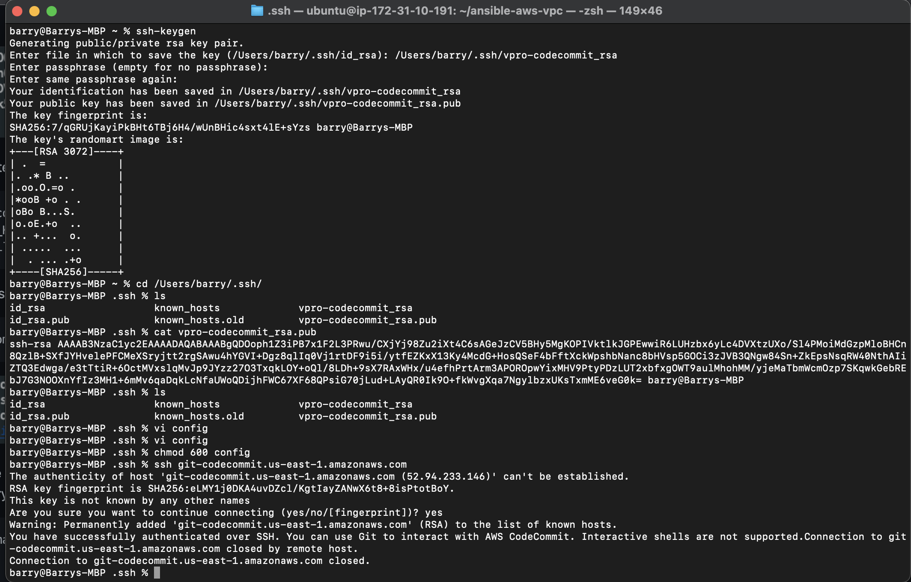
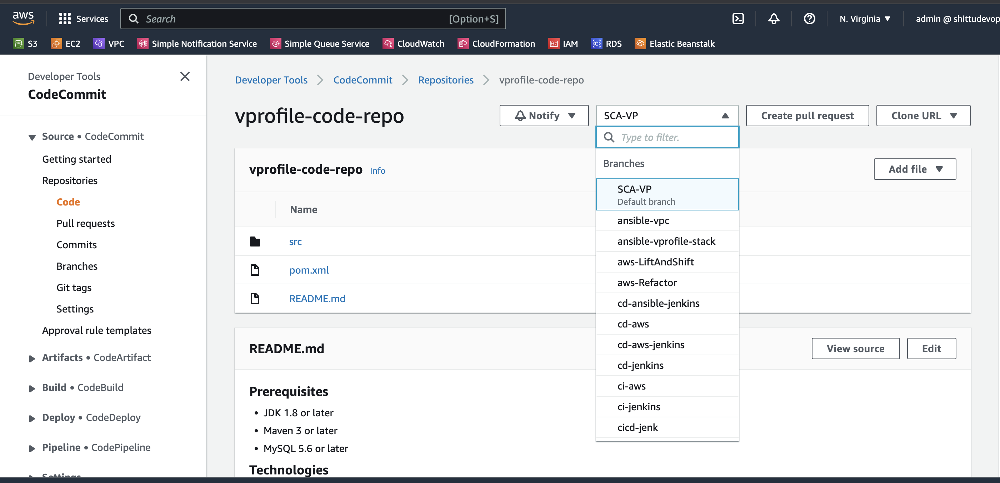
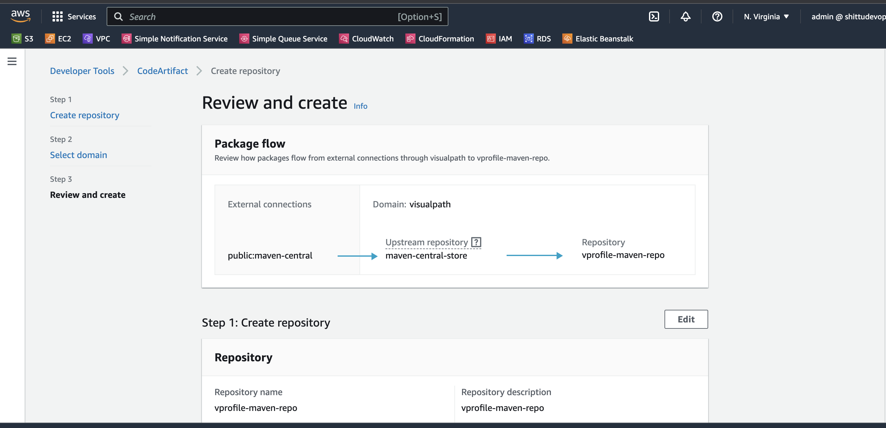
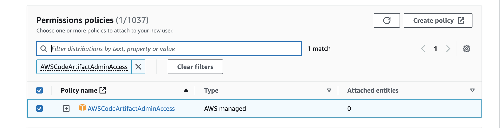

#  CONTINUOUS DELIVERY ON AWS

##  Prerequisite
  + AWS managed service which include: Code commit, Code artifact, Code build and Code deploy, Code pipeline
  + SolarCloud
  + Checkstyle
  + Code editor (e.g sublime, vscode)
  + Selenium software test
  + Beanstalk
  + Relational Database Service

##  System Design

## Step 1: AWS CodeCommit Setup 
  + Login to your AWS management console and navigate to CodeCommit section

        CodeCommit > Repository > Create Repository
        Repository details
        name: vprofile-code-repo
  + Create an IAM user for the CodeCommit been created

        IAM > Add user
        --------------
        details of user
        Name: vprofile-code-admin
        Attach policy: Attach the policy created below
        ---------------
        Create a policy to be attached
        service: CodeCommit
        name: vprofile-code-repo
        action: all
        Plicy name: vprofile-code-admin-repo-fullaccess
  + After the creation of the IAM user we can upload SSH public key within the Security credentials section of the newly created user. Generate SSH from our local machine and upload in this section.
  + Create a `config` file at the working directory where we created the ssh key. Working directory:- .ssh/config

        vi .ssh/config
        --------------
        Host git-codecommit.us-east-1.amazonaws.com
        User <SSH_Key_ID_from IAM_user>
        IdentityFile ~/.ssh/vpro-codecommit_rsa
  + Chnage the permission of the config file 

        chmod 600 config
  + We can now test our SSH connection to AWS CodeCommit by running the command

        ssh git-codecommit.us-east-1.amazonaws.com
    
  + Next we clone the repository to a location that we want in our local. I will use the Github repository for vprofile-project in my local, and turn this repository to CodeCommit repository. When I am in Github repo directory, I will run below commands. [source](https://github.com/sadebare/vprofile-project)

        git checkout master
        git branch -a | grep -v HEAD | cut -d'/' -f3 | grep -v master > /tmp/branches
        for i in `cat  /tmp/branches`; do git checkout $i; done
        git fetch --tags
        git remote rm origin
        git remote add origin ssh://git-codecommit.us-east-1.amazonaws.com/v1/repos/vprofile-code-repo
        cat .git/config
        git push origin --all
        git push --tags
    

## Step 2: Code artifact Setup And AWS System Manager Parameter Store
  + Create a Code Artifact for maven 

        Repository name: vprofile-maven-repo
        Public upstream repositories: maven-central-store
        AWS account: current account
        Domain name: visualpath
    
  + Again we will follow connection instructions given in CodeArtifact for maven-central-repo.
    
  + Create an IAM user for CodeArtifact and configure aws cli with its credentials. We will give Programmatic access to this user to be able to use aws cli and download credentials file.

        aws configure # provide iam user credentials

      
  + Run the command below for CodeArtifact authorization token for authorization to your repository 

        export CODEARTIFACT_AUTH_TOKEN=`aws codeartifact get-authorization-token --domain visualpath --domain-owner 438199817329 --region us-east-1 --query authorizationToken --output text`
  + Switch to the working directory that has the repo we are working on and chckout the repo to ci-aws branch

        git checkout ci-aws
  + Update pom.xml and setting.xml file with correct urls as suggested in instruction and push these files to codeCommit.

        git add .
        git commit -m "message"
        git push origin ci-aws
  
##  Step 3: SonarCloud setup For Code Analysis
  + On th brouser paste the url and sign up for sonarcloud account

        https://sonarcloud.io
  + From account avatar -> My Account -> Security. Generate token name as `vprofile-sonar-cloud`. Note the token.
    
  + Next we create a project, `+` -> `Analyze Project` -> `create project manually`. Below details will be used in our Build.

        Organization: sadebare-projectssadebare-projects
        Name: vprofile-repo
        public
      1[sonar](./images/valid_sonar.png)
##  Step 4: Store Sonar variables in System Manager Parameter Store
  + We will create paramters for below variables.

        Organization: sadebare-projectssadebare-projects
        CODEARTIFACT_TOKEN	 SecureString	
        HOST      https://sonarcloud.io
        PROJECT                vprofile-repo-rd
        SONARTOKEN             SecureString

##  Step 5: AWS CodeBuild for SonarQube Code Analysis
  + From AWS Console, go to CodeBuild -> Create Build Project. This step is similar to Jenkins Job.
      
        ProjectName: Vprofile-Build
        Source: CodeCommit
        Branch: ci-aws
        Environment: Ubuntu
        runtime: standard:5.0
        New service role
        Insert build commands from foler aws-files/sonar_buildspec.yml
        Logs-> GroupName: vprofile-buildlogs
        StreamName: sonarbuildjob
  + We need to update sonar_buildspec.yml file paramter store sections with the exact names we have given in SSM Parameter store.
  + We need to add a policy to the service role created for this Build project. Find name of role from Environment, go to IAM add policy
  + Now we can build the project
    
  + I can add Quality Gate to this Build Project, we can create a Qulaity gate from SonarCloud and add to our project.

##  Step 6: AWS CodeBuild for Build Artifact
  + From AWS Console, go to CodeBuild -> Create Build Project. This step is similar to Jenkins Job.

        ProjectName: Vprofile-Build-Artifact
        Source: CodeCommit
        Branch: ci-aws
        Environment: Ubuntu
        runtime: standard:5.0
        Use existing role from previous build
        Insert build commands from foler aws-files/build_buildspec.yml
        Logs-> GroupName: vprofile-buildlogs
        StreamName: artifactbuildjob
  + Its time to build project.
  
##  Step 7: AWS CodePipeline and Notification with SNS
  + First we will create an SNS topic from SNS service and subscribe to topic with email.
  + We need confirm our subscription from our email.
  + Now we create an S3 bucket to store our deployed artifacts.
  + Create CodePipeline with the information

        Name: vprofile-CI-Pipeline
        SourceProvider: Codecommit
        branch: ci-aws
        Change detection options: CloudWatch events
        Build Provider: CodeBuild
        ProjectName: vprofile-Build-Aetifact
        BuildType: single build
        Deploy provider: Amazon S3
        Bucket name: vprofile98-build-artifact
        object name: pipeline-artifact
  + Last step before running our pipeline is we need to setup Notifications, go to Settings in CodePipeline -> Notifications.
  + Let's run our CodePipeline.
  
##  Step 8: Validate CodePipeline
  + We can make some changes in README file of source code, once we push the changes CloudWatch will detect the changes and Notification event will trigger Pipeline.

##  Step 9: Beanstalk Setup
  + We will be creating a beanstalk environment with the below configuration

        Application name: vprofile-app
        Platform: Tomcat
        Capacity: Loadbalanced
                  min: 2
                  max: 4
        Security: choose the key pair been used right from the beginning of the project
        Tags: 
              Key: Project
              value: vprofile
##  Step 10: Relational Database Setup
  + Create a rds database with below configuration

        Method: standard create
        Engine: MySql
        version: 5.6.34
        Templates: free tier
        instance identifier: vprofile-cicd-project
        Create new SecGrp: 
        * Name: vprofile-cicd-rds-mysql-sg
        Additional Configurations: 
        * initial db name: accounts
##  Step 11: Update RDS Security Group And Database Initialization
  + Navigate to the instances running because the beanstalk automatically generated an instance, the we need to update the security group to allow traffic from beanstalk security group on port 3306
  + Let us get into the beanstalk instance through SSH and initialize the database to install git and mysql

        sudo -i
        yum install mysql git -y
        mysql -h <RDS_endpoint> -u <RDS_username> -p<RDS_password>
        show databases;
        git clone https://github.com/sadebare/vprofile-project
        cd vprofileproject-all/
        git checkout cd-aws
        cd src/main/resources
        mysql -h <RDS_endpoint> -u <RDS_username> -p<RDS_password> accounts < db_backup.sql
        mysql -h <RDS_endpoint> -u <RDS_username> -p<RDS_password>
        use accounts;
        show tables;
  + Environment health check on the beanstalk loadbalacer needs to be updated to `/login`

##  Step 12: Update Code with Pom.xml And Setting.xml
  + On our codepipeline, navigate the the code repository on branch `cd-aws`, we can edit right from the codecommit service. 
  + Time to edit, for pom.xml, add the correct url from your code artifact connection steps:

             <repository>
                <id>codeartifact</id>
                <name>codeartifact</name>
            <url>https://visualpath-392530415763.d.codeartifact.us-east-1.amazonaws.com/maven/maven-central-store/</url>
              </repository>
  + for settings.xml, update below parts with correct url from code artifact.

          <profiles>
          <profile>
            <id>default</id>
            <repositories>
              <repository>
                <id>codeartifact</id>
            <url>https://visualpath-392530415763.d.codeartifact.us-east-1.amazonaws.com/maven/maven-central-store/</url>
              </repository>
            </repositories>
          </profile>
        </profiles>
        <activeProfiles>
                <activeProfile>default</activeProfile>
            </activeProfiles>
        <mirrors>
          <mirror>
            <id>codeartifact</id>
            <name>visualpath-maven-central-store</name>
            <url>https://visualpath-392530415763.d.codeartifact.us-east-1.amazonaws.com/maven/maven-central-store/</url>
            <mirrorOf>*</mirrorOf>
          </mirror>
        </mirrors>

##  Step 13: Build Job Setup
  + First, we will go to CodeBuild and change Source for Vprofile-Build & Vprofile-build-Artifact projects. Currently these projects are triggered from ci-aws branch, we will change branch to cd-aws.

  + Create BuildAndRelease Build Project

        Name: Vprofile-BuildAndRelease
        Repo: CodeCommit
        branch: cd-aws
        Environment
        *Managed image: Ubuntu
        *Standard
        Image 5.0
        We will use existing role from previous Build project which has access to SSM Parameter Store
        Insert build commands: 
        * From source code we will get spec file under `aws-files/buildAndRelease_buildspec.yml`.
        Logs:
        *LogGroup:vprofile-cicd-logs
        *StreamnameBuildAndReleaseJob
  + We need to create 3 new parameters that we used in BuilAndRelease_buildspec.yml file in SSM Parameter store. we have noted these values from RDS creation step, we will use them now.

        RDS-Endpoint: String
        RDSUSER: String
        RDSPASS: SecureString
  + Let's build, we have worked so hard to see the build job

      
##  Step 14: Create SoftwareTesting Build Project
  + In this Build Project, we will run our Selenium Automation scripts and store the artifacts in S3 bucket

  + First we will create an S3 bucket

        Name: vprofile-cicd-testoutput-rd (give a unique name)
        Region: it should be the same region we create our pipeline
  + Next, we will create a new Build project for Selenium Automation Tests. Create a new Build project with below details:

        Name: SoftwareTesting
        Repo: CodeCommit
        branch: seleniumAutoScripts
        Environment:
        * Windows Server 2019
        * Runtime: Base
        * Image: 1.0
        We will use existing role from previous Build project which has access to SSM Parameter Store
        Insert build commands: 
        * From source code we will get spec file under `aws-files/win_buildspec.yml`.
        * We need to update url part to our Elastic Beanstalk URL.
        Artifacts:
        *Type: S3
        * Bucketname: vprofile-cicd-testoutput-rd
        * Enable semantic versioning
        Artifcats packaging: zip
        Logs:
        *LogGroup: vprofile-cicd-logs
        *Streamname: Softwaretestlog

##  Step 15: Pipeline setup
  + We will create CodePipeline with name of vprofile-cicd-pipeline

        Source:
        * CodeCommit
        * vprofile-code-repo
        * cd-aws
        * Amazon CloudWatch Events

        Build
        * BuildProvider: CodeBuild
        * ProjectName: Vprofile-BuildAndRelease
        * Single Build

        Deploy
        * Deploy provider: Beanstalk
        * application: vprofile-app
        * Environment: vprofile-app-env
  + We will Disable transitions and Edit pipeline to add more stages.
  + First Stage added after Source:

        Name: CodeAnalysis
        Action provider: CodeBuild
        Input artifacts: SourceArtifact
        Project name: Vprofile-Build
  + Second Stage will be added after CodeAnalysis stage:

        Name: BuildAndStore
        Action provider: CodeBuild
        Input artifacts: SourceArtifact
        Project name: Vprofile-Build-artifact
        OutputArtifact: BuildArtifact
  + Third Stage will be added after BuildAndStore stage:

        Name: DeployToS3
        Action provider: Amazon S3
        Input artifacts: BuildArtifact
        Bucket name: vprofile98-build-artifact
        Extract file before deploy
  + We need to Edit ouput artifacts of Build and Deploy stages. Go to Build stage `Edit Stage`. Change Output artifact name as `BuildArtifactToBean`.
  + Go to Deploy stage,`Edit stage`. We change `InputArtifact` to `BuildArtifactToBean`
  + Last Stage will be added after Deploy stage:

        Name: Software Testing
        Action provider: CodeBuild
        Input artifacts: SourceArtifact
        ProjectName: SoftwareTesting
  + Save and Release change. It will start our CodePipeline.
##  Step 16: SNS Notification
  + We will select our pipeline. Click Notify, then Manage Notification. We will create a new notification and save.

        vprofile-aws-cicd-pipeline-notification
        Select all
        Notification Topic: use same topic from CI pipeline
##  Step 17: Validate & Test
  + It's time to test our pipeline.
      
  + We can check the app from browser with Beanstalk endpoint.
  