#   Ansible For AWS Virtual Private Cloud (VPC)
##  Pre-Requisite
+   AWS account
+   Ansible
+   IDE (Sublime, Vscode)
+   Github account, Git 

##  System Design
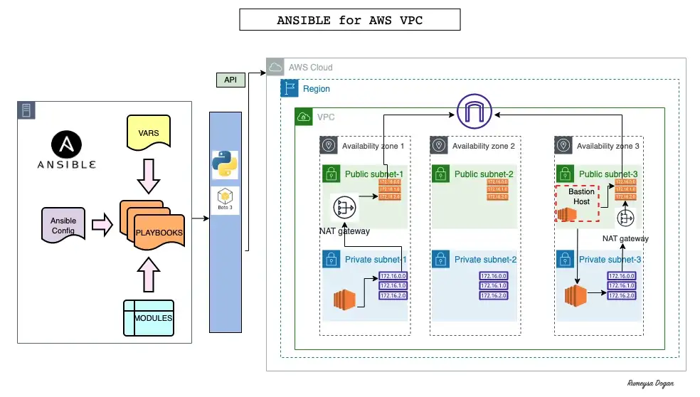

##  Step 1 : Ansible Setup On AWS EC2
  + On our AWS mangement console, we navigate to the instance and launch an instance with the following specification

        AMI: Ubuntu, 20.04 LTS
        instance type: t2.micro
        security group: port 22
        -----------------------
        userdata:
        #!/bin/bash
        sudo apt update
        sudo apt install ansible -y
  + Navigate to the IAM section and create a role to be used by the ansible on the ec2 instance by attaching a Administratoraccess then we assign it to the ec2 instance running for ansible.
  + Let us verify if the IAM is correctly attached to the instance by running a command, but before that let us install aws cli

        sudo apt install awscli -y
        aws sts get-caller-identity
##  Step 2: Warm Up For AWS Cloud Playbooks
  + Create a project directory in the ansible instance running

        mkdir vpc-stack-vprofile
        cd vpc-stack-vprofile
        vi test-aws.yml
  + Here we will be creating an ec2 instance using the playbook and paste the following yml text. documentation:- https://docs.ansible.com/ansible/2.8/modules/ec2_key_module.html#ec2-key-module

      - hosts: localhost
        connection: local
        gather_facts: False
        tasks:
          - name: sample ec2 key
            ec2_key:
              name: sample
              region: us-east-2
  + Before we run our playbook, we need some dependencies such as boto3 and pip, we do so by running the cmd

        sudo apt install python3-boto3 -y
  + Our playbook can successsfully run now since the dependencies are installed by running

        ansible-playbook test-aws.yml
    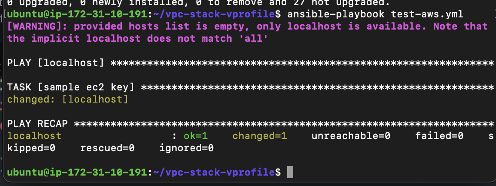
  + We have successfully created a key on the console but we do not have the private key generated on our instance which is also a problem
    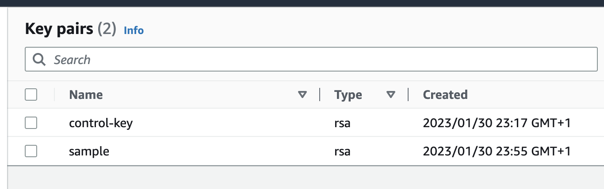
  + Let us resolve the problem by generating the key and having the private key downloaded on our instance. Edit the playbook and run again

        - hosts: localhost
          connection: local
          gather_facts: False
          tasks:
            - name: sample ec2 key
              ec2_key:
                name: sample
                region: us-east-2
              register: keyout

            - debug:
                var: keyout
  + Run the command again

        ansible-playbook test-aws.yml
    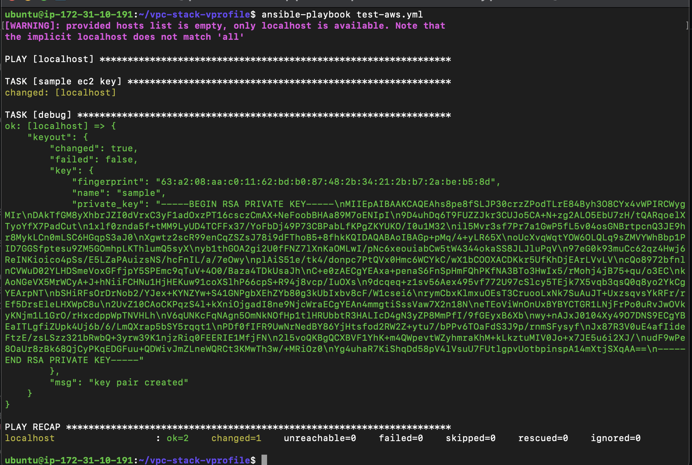
  + Here, we see the private key generated on the screen after running the command but still we need a better way to resolve this so it can actually store the key in a file
  + Let us modify the file once again to have a key file using the copy module from the documentation

        - hosts: localhost
          connection: local
          gather_facts: False
          tasks:
            - name: sample ec2 key
              ec2_key:
                name: sample
                region: us-east-2
              register: keyout

            - debug:
                var: keyout

            - name: store login key
              copy:
                content: "{{keyout.key.private_key}}"
                dest: ./sample-key.pem
              when: keyout.changed
    + Then we execute the command `ansible-playbook test-aws.yml` and also we see our `.pem` file in the working directory.
  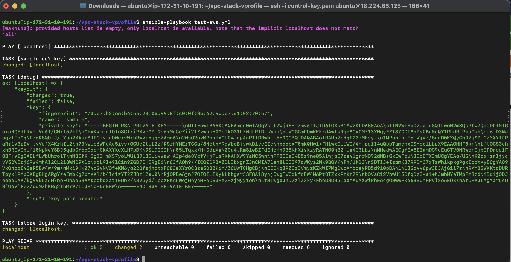

##  Step 3: Variables For VPC
  + Create a new public repository on Github with the name `ansible-aws-vpc` where we store all the playbooks to be used on the instance provisioned for ansible.
  + In the github repo, create a variable file for vpc and bastion `vpc_setup` and `bastion_setup`

        `vpc_setup` file
        -----------------------------------
        vpc_name: "Vprofile-vpc"

        #VPC Range
        vpcCidr: '172.20.0.0./16'

        #Subnets Range
        PubSub1Cidr: 172.20.1.0/24
        PubSub2Cidr: 172.20.2.0/24
        PubSub3Cidr: 172.20.3.0/24
        PrivSub1Cidr: 172.20.4.0/24
        PrivSub2Cidr: 172.20.5.0/24
        PrivSub3Cidr: 172.20.6.0/24

        #Region Name
        region: "us-east-2"

        #Zone Names
        zone1: us-east-2a
        zone2: us-east-2b
        zone3: us-east-2c

        state: present
  + Bastion_setup file

        bastion_ami: ami-05bfbece1ed5beb54 # Amazon Linux-2 AMI-ID from us-east-2 region
        region: us-east-2
        MYIP: IP_address_of_your_laptop/32
        keyName: vprofile-key
        instanceType: t2.micro
  + We can push that to the repository created 

##  Step 4: VPC play
  + Create a playbook `vpc_setup.yml` with below content:

        - hosts: localhost
          connection: local
          gather_facts: False
          tasks:
            - name: Import VPC Variables
              include_vars: vars/vpc_setup

            - name: Create Vprofile VPC
              ec2_vpc_net:
                name: "{{vpc_name}}"
                cidr_block: "{{vpcCidr}}"
                region: "{{region}}"
                dns_support: yes
                dns_hostnames: yes
                tenancy: default
                state: "{{state}}"
              register: vpcout
  + we can then push to our remote repository and pull it also from out ansible instance created. Run the command `ansible-playbook vpc_setup.yml`
  
  + Verify the vpc created from the console
      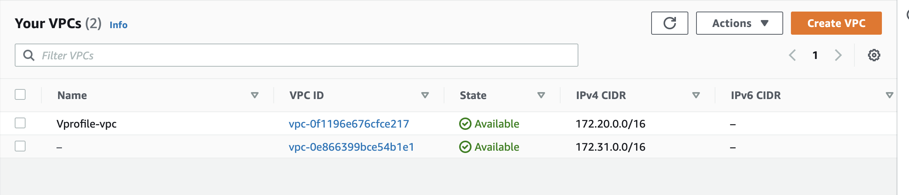

##  Step 5: Subnet Play
  + Append the below yaml code to the previous vpc_setup.yml file

        #    - debug:
        #        var: vpcout

            - name: create Public Subnet 1 in Zone1
              ec2_vpc_subnet:
                vpc_id: "{{vpcout.vpc.id}}"
                region: "{{region}}"
                az: "{{zone1}}"
                state: "{{state}}"
                cidr: "{{PubSub1Cidr}}"
                map_public: yes
                tags:
                    Name: vprofile-pubsub1
              register: pubsub1_out

            - name: create Public Subnet 2 in Zone2
              ec2_vpc_subnet:
                vpc_id: "{{vpcout.vpc.id}}"
                region: "{{region}}"
                az: "{{zone2}}"
                state: "{{state}}"
                cidr: "{{PubSub2Cidr}}"
                map_public: yes
                tags:
                  Name: vprofile-pubsub2
              register: pubsub2_out

            - name: create Public Subnet 3 in Zone3
              ec2_vpc_subnet:
                vpc_id: "{{vpcout.vpc.id}}"
                region: "{{region}}"
                az: "{{zone3}}"
                state: "{{state}}"
                cidr: "{{PubSub3Cidr}}"
                map_public: yes
                tags:
                  Name: vprofile-pubsub3
              register: pubsub3_out

            - name: create Private Subnet 1 in Zone1
              ec2_vpc_subnet:
                vpc_id: "{{vpcout.vpc.id}}"
                region: "{{region}}"
                az: "{{zone1}}"
                state: "{{state}}"
                cidr: "{{PrivSub1Cidr}}"
                map_public: yes
                tags:
                    Name: vprofile-privsub1
              register: privsub1_out

            - name: create Private Subnet 2 in Zone2
              ec2_vpc_subnet:
                vpc_id: "{{vpcout.vpc.id}}"
                region: "{{region}}"
                az: "{{zone2}}"
                state: "{{state}}"
                cidr: "{{PrivSub2Cidr}}"
                map_public: yes
                tags:
                  Name: vprofile-privsub2
              register: privsub2_out

            - name: create Private Subnet 3 in Zone3
              ec2_vpc_subnet:
                vpc_id: "{{vpcout.vpc.id}}"
                region: "{{region}}"
                az: "{{zone3}}"
                state: "{{state}}"
                cidr: "{{PrivSub3Cidr}}"
                map_public: yes
                tags:
                  Name: vprofile-privsub3
              register: privsub3_out

  + After which we can push the code to github and pull it on ansible instance. Then run the ansible command

        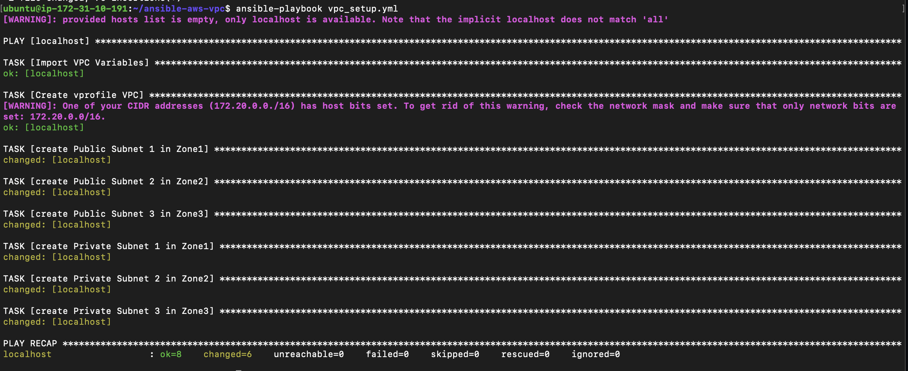
  + This successfully created 3 public subnet and private subnet in our newly created vpc
    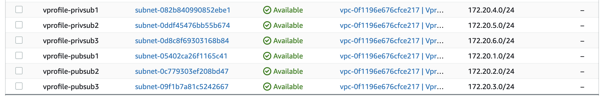

##  Step 6: Internet Gateway and Public Route Table
  + Also append the below content to the `vpc_setup.yml` file

            - name: Internet Gateway Setup
              ec2_vpc_igw:
                vpc_id: "{{vpcout.vpc.id}}"
                region: "{{region}}"
                state:  "{{state}}"
                tags:
                  Name: vprofile-igw
              register: igw_out

            - name: Setup Public Subnet Route Table
              ec2_vpc_route_table:
                vpc_id: "{{vpcout.vpc.id}}"
                region: "{{region}}"
                tags:
                  Name: Vprofile-PubRT
                subnets:
                    - "{{ pubsub1_out.subnet.id }}"
                    - "{{ pubsub2_out.subnet.id }}"
                    - "{{ pubsub3_out.subnet.id }}"
                routes:
                  - dest: 0.0.0.0/0
                    gateway_id: "{{ igw_out.gateway_id }}"
              register: pubRT_out
    + Push to the Github and also pull from ansible instance. Then execute the ansible command

        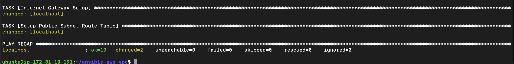
        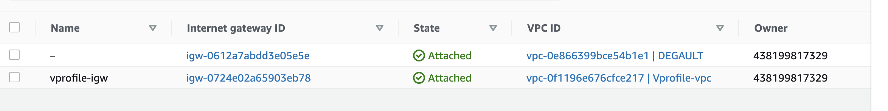
        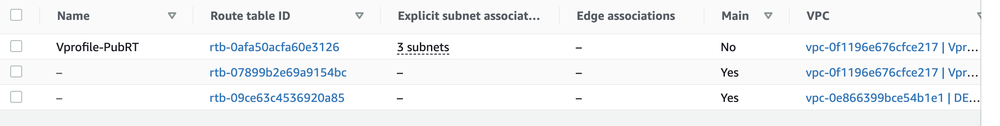

##  Step 7: NAT Gateway and Private Route Table
  + Also append the below content to the `vpc_setup.yml` file

            - name: NAT Gateway1 Setup and allocate new EIP if NATGW does not exist yet in the subnet
              ec2_vpc_nat_gateway:
                subnet_id: "{{ pubsub1_out.subnet.id }}"
                region: "{{region}}"
                state:  "{{state}}"
                wait: yes
                if_exist_do_not_create: yes
              register: natgw1_out

            - name: Setup Private Subnet Route Table
              ec2_vpc_route_table:
                vpc_id: "{{vpcout.vpc.id}}"
                region: "{{region}}"
                tags:
                  Name: Vprofile-PrivRT1
                subnets:
                    - "{{ privsub1_out.subnet.id }}"
                    - "{{ privsub2_out.subnet.id }}"
                routes:
                  - dest: 0.0.0.0/0
                    gateway_id: "{{ natgw1_out.nat_gateway_id }}"
              register: privRT1_out

            - name: NAT Gateway3 Setup and allocate new EIP if NATGW does not exist yet in the subnet
              ec2_vpc_nat_gateway:
                subnet_id: "{{ pubsub3_out.subnet.id }}"
                region: "{{region}}"
                state:  "{{state}}"
                wait: yes
                if_exist_do_not_create: yes
              register: natgw3_out

            - name: Setup Private Subnet Route Table2
              ec2_vpc_route_table:
                vpc_id: "{{vpcout.vpc.id}}"
                region: "{{region}}"
                tags:
                  Name: Vprofile-PrivRT3
                subnets:
                    - "{{ privsub3_out.subnet.id }}"
                routes:
                  - dest: 0.0.0.0/0
                    gateway_id: "{{ natgw3_out.nat_gateway_id }}"
              register: privRT3_out

            - debug:
                var: "{{ item }}"
              loop:
                - vpcout.vpc.id
                - pubsub1_out.subnet.id
                - pubsub2_out.subnet.id
                - pubsub3_out.subnet.id
                - privsub1_out.subnet.id
                - privsub2_out.subnet.id
                - privsub3_out.subnet.id
                - igw_out.gateway_id
                - pubRT_out.route_table.id
                - natgw1_out.nat_gateway_id
                - privRT1_out.route_table.id
                - natgw3_out.nat_gateway_id
                - privRT3_out.route_table.id

            - set_fact:
                vpcid: "{{ vpcout.vpc.id }}"
                pubsub1id: "{{ pubsub1_out.subnet.id }}"
                pubsub2id: "{{ pubsub2_out.subnet.id }}"
                pubsub3id: "{{ pubsub3_out.subnet.id }}"
                privsub1id: "{{ privsub1_out.subnet.id }}"
                privsub2id: "{{ privsub2_out.subnet.id }}"
                privsub3id: "{{ privsub3_out.subnet.id }}"
                igwid: "{{ igw_out.gateway_id }}"
                pubRTid: "{{ pubRT_out.route_table.id }}"
                natgw1id: "{{ natgw1_out.nat_gateway_id }}"
                privRT1id: "{{ privRT1_out.route_table.id }}"
                natgw3id: "{{ natgw3_out.nat_gateway_id }}"
                privRT3id: "{{ privRT3_out.route_table.id }}"
                cacheable: yes

            - name: Create variables file for vpc Output
              copy:
                content: "vpcid: {{ vpcout.vpc.id }}\npubsub1id: {{ pubsub1_out.subnet.id }}\npubsub2id: {{ pubsub2_out.subnet.id }}\npubsub3id: {{ pubsub3_out.subnet.id }}\nprivsub1id: {{ privsub1_out.subnet.id }}\nprivsub2id: {{ privsub2_out.subnet.id }}\nprivsub3id: {{ privsub3_out.subnet.id }}\nigwid: {{ igw_out.gateway_id }}\npubRTid: {{ pubRT_out.route_table.id }}\nnatgw1id: {{ natgw1_out.nat_gateway_id }}\nprivRT1id: {{ privRT1_out.route_table.id }}\nnatgw3id: {{ natgw3_out.nat_gateway_id }}\nprivRT3id: {{ privRT3_out.route_table.id }}"

                dest: vars/output_vars

  + Push to the Github and also pull from ansible instance. Then execute the ansible command where we have a file created in vars directory
  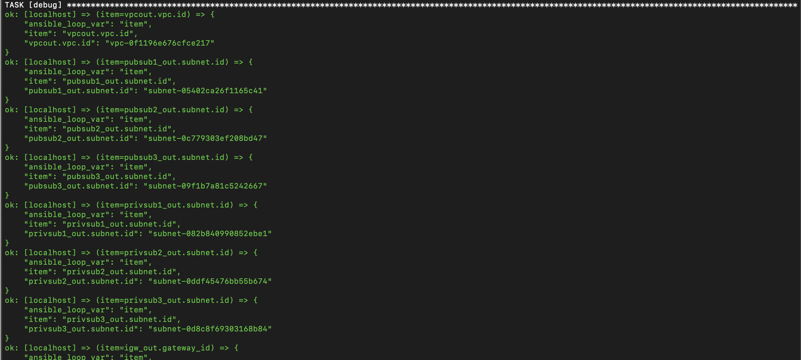
##  Step 7: Baston Host Setup
  + We will create bastion-host.yml file, commit-push to GitHub.

        ---
        - name: Setup Vprofile Bastion Host
          hosts: localhost
          connection: local
          gather_facts: no
          tasks:
            - name: Import VPC setup variable
              include_vars: vars/bastion_setup

            - name: Import VPC setup Variable
              include_vars: vars/output_vars

            - name: Create vprofile ec2 key
              ec2_key:
                name: "{{ keyName }}"
                region: "{{ region }}"
              register: key_out

            - name: Save private key into file bastion-key.pem
              copy:
                content: "{{ key_out.key.private_key }}"
                dest: "./bastion-key.pem"
                mode: 0600
              when: key_out.changed

            - name: Create Sec Grp for Bastion Host
              ec2_group:
                name: Bastion-host-sg
                description: Allow port 22 from everywhere and all port within sg
                vpc_id: "{{ vpcid }}"
                region: "{{ region }}"
                rules:
                  - proto: tcp
                    from_port: 22
                    to_port: 22
                    cidr_ip: "{{ MYIP }}"
              register: BastionSG_out

            - name: Creating Bastion Host
              ec2:
                key_name: "{{ keyName }}"
                region: "{{ region }}"
                instance_type: "{{ instanceType }}"
                image: "{{ bastion_ami }}"
                wait: yes
                wait_timeout: 300
                instance_tags:
                  Name: "Bastion_host"
                  Project: Vprofile
                  Owner: DevOps Team
                exact_count: 1
                count_tag:
                  Name: "Bastion_host"
                  Project: Vprofile
                  Owner: DevOps Team
                group_id: "{{ BastionSG_out.group_id }}"
                vpc_subnet_id: "{{ pubsub3id }}"
                assign_public_ip: yes
              register: bastionHost_out

            - name: Creating EC2 in privsub1
              ec2:
                key_name: "{{ keyName }}"
                region: "{{ region }}"
                instance_type: "{{ instanceType }}"
                image: "{{ bastion_ami }}"
                wait: yes
                wait_timeout: 300
                instance_tags:
                  Name: "privsub1Instance"
                  Project: Vprofile
                  Owner: DevOps Team
                exact_count: 1
                count_tag:
                  Name: "privsub1Instance"
                  Project: Vprofile
                  Owner: DevOps Team
                vpc_subnet_id: "{{ privsub1id }}"
                assign_public_ip: yes
              register: privsub1Instance_out

            - name: Creating EC2 in privsub3
              ec2:
                key_name: "{{ keyName }}"
                region: "{{ region }}"
                instance_type: "{{ instanceType }}"
                image: "{{ bastion_ami }}"
                wait: yes
                wait_timeout: 300
                instance_tags:
                  Name: "privsub3Instance"
                  Project: Vprofile
                  Owner: DevOps Team
                exact_count: 1
                count_tag:
                  Name: "privsub3Instance"
                  Project: Vprofile
                  Owner: DevOps Team
                vpc_subnet_id: "{{ privsub3id }}"
                assign_public_ip: yes
                group_id: "{{ BastionSG_out.group_id }}"
              register: privsub3Instance_outGo to Ansible server.
  +  First Git pull, then run the playbook.Check BastionHost from AWS console.
  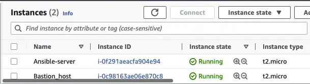
##  Clean up
+ Delete all resources to avoid unneccessary bills